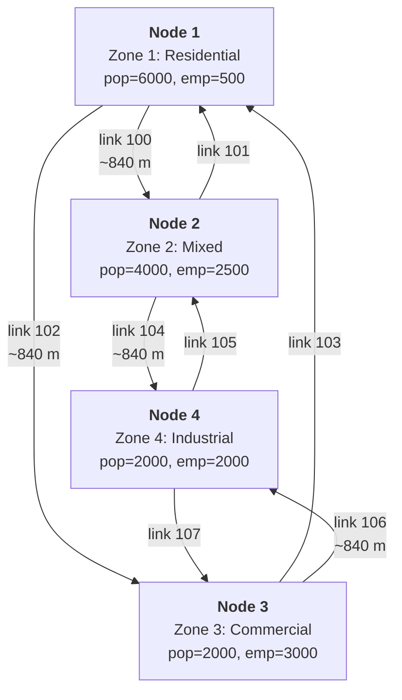

# multimodal

A multimodal city in memory: personal cars and public transit sharing one 4-step run on one GMNS network. No external files needed.

The road side is [`path_analysis_multi_class`](../path_analysis_multi_class/README.md): full 4-step pipeline, two user classes (car + truck), `store_paths`, OD path query and select link analysis. On top of it this example adds a public transit layer and, crucially, lets `mode choice` step decide how much demand goes to transit:

- six stops as GMNS `location` records pinned to the road links (the road graph itself is never modified);
- two bus lines and a tram line, each with a reverse twin;
- zone centroids (the zone IDs themselves) connected to nearby stops by walk links - the assignment itself picks the access stop per destination;
- transit as a **fourth mode-choice alternative** (auto/bike/walk/transit): the logit splits the total demand using a transit skim, and the resulting transit share is assigned with the optimal strategies algorithm (Spiess & Florian, 1989) by the [hyperpaths-rs](https://crates.io/crates/hyperpaths-rs) crate.

Both the road and transit demand come from the one 4-step run; mode choice is where they part. (For a manually supplied transit OD assigned on its own, see the [`transit`](../transit/README.md) and [`transit_gtfs`](../transit_gtfs/README.md) examples.)

## Run

```sh
cargo run --example multimodal
```

## Road layer

4 intersection nodes arranged as a diamond, each serving as a zone centroid:

```text
       Zone 1 (residential)
              [1]
            /     \
         [3]       [2]
Zone 3 (commercial)  Zone 2 (mixed)
            \     /
              [4]
       Zone 4 (industrial)
```

Detailed view with link IDs and zone attributes
(if your Markdown viewer does not render mermaid format, just use https://mermaid.live live viewer/editor):



Each diamond edge is a pair of one-way road segment links (forward + reverse), giving 8 road links total, plus 8 connection links for turns. All road segments: 2 lanes, 60 km/h free speed, 1800 veh/h capacity.

## Transit layer

Both layers in one picture: the road diamond with the stop locations pinned to its links (`[..]` = intersection node, `o` = stop location at its offset, link IDs on the edges):

```text
                    [1]
              102 /     \ 100
             821 o       o 811
                 |       |
             823 o       o 812
                 |       |
               [3]       [2]
                 |       |
             824 o       o 814
              106 \     / 104
                   \   /
                    [4]

      west side:                 east side:
      tram T1 (821-823-824)      bus B1 (811-812-814)
                                 bus B2 (811-814 express)
```

The chains read top to bottom: the eastern buses run [1] - 811 - 812 - [2] - 814 - [4] along links 100 and 104, the western tram runs [1] - 821 - 823 - [3] - 824 - [4] along links 102 and 106. The road graph itself contains none of this - the stops exist only as `location` records referencing the links.

### Stops as GMNS locations

The stops are `location` records: points on road links (`link_id` + `lr` offset from the reference node), the road graph knows nothing about them. Eastern side (links 100, 104) hosts the bus stops, western side (links 102, 106) the in-street tram stops. One platform per stop serves both directions here; a real model would split them per direction.

| Location | On link | Offset | Type | Near |
|----------|---------|--------|------|------|
| 811 | 100 (1 -> 2) | 100 m | bus_stop | zone 1 |
| 812 | 100 (1 -> 2) | 700 m | bus_stop | zone 2 |
| 814 | 104 (2 -> 4) | 750 m | bus_stop | zone 4 |
| 821 | 102 (1 -> 3) | 100 m | tram_stop | zone 1 |
| 823 | 102 (1 -> 3) | 700 m | tram_stop | zone 3 |
| 824 | 106 (3 -> 4) | 750 m | tram_stop | zone 4 |

### Lines

| Line | Stops | Segments (min) | Headway (min) | Note |
|------|-------|----------------|---------------|------|
| B1 | 811 -> 812 -> 814 | 6, 7 | 6 | local bus, east |
| B2 | 811 -> 814 | 11 | 12 | express bus, east |
| T1 | 821 -> 823 -> 824 | 5, 5 | 8 | tram, west |

Each line has a reverse twin (`B1r`, `B2r`, `T1r`) with the same times, because a `TransitRoute` is one-way. B1 and B2 share stops 811 and 814, so a zone 1 -> zone 4 passenger faces the classic Spiess-Florian situation: wait for whichever attractive bus comes first.

### Zone access

The zone centroid is the zone ID itself (1-4). Using the road zone IDs as transit centroids is what lets a single OD matrix split across road and transit modes - a trip to zone 4 is a trip to zone 4 whether it drives or rides. Each centroid connects to its candidate stops by walk links (both directions, minutes); zones 1 and 4 reach both sides of the network:

```text
                   (1) zone 1
                 /            \
            walk 4.0        walk 3.0
               /                \
           [821]               [811] ---- B2: 11 ----+
             |                   |                    \
           T1: 5               B1: 6                   \
             |                   |                      |
           [823] -2.0- (3)     [812] -2.0- (2)          |
             |                   |                      |
           T1: 5               B1: 7                    |
             |                   |                      /
           [824]               [814] <-----------------+
               \                /
            walk 3.0        walk 2.0
                 \            /
                   (4) zone 4
```

There is no "assign the zone to its nearest stop" step: the centroid is connected to several candidate stops and phase 1 of the algorithm decides which of them is actually used, separately for every destination.

## How transit joins the 4-step pipeline

`run_four_step_model` takes an optional `TransitInput { network, options }`. When present:

1. Transit skim:
Before the feedback loop, the pipeline runs the optimal strategies label-setting once per destination zone over the transit network, producing a zone-to-zone expected travel time matrix. These labels are flow-independent, so the skim is computed once and reused.
2. Mode choice with four alternatives:
The logit ([`default_auto_bike_walk_transit`](../../src/mode_choice/logit.rs)) splits the total OD into auto/bike/walk/transit, the transit utility fed by the skim. Pairs with no transit path get zero transit share.
3. Assignment:
The auto share is loaded on the road network (split further into car/truck), and the final transit share is assigned with optimal strategies. Both results come back in one `PipelineResult`.

The mode split for this city:

| Mode | Trips | Share |
|------|-------|-------|
| Auto | 4751 | 61% |
| Bike | 1491 | 19% |
| Transit | 1292 | 17% |
| Walk | 266 | 3% |

Transit is now endogenous: change a headway or a walk time and the transit skim shifts, mode choice reacts, and both the transit and the road loads move.

## The transit skim, step by step

The skim is the phase-1 label of the optimal strategy: the expected travel time from every zone to a destination, computed with no demand. Here is the trace to destination zone 4, the richest one (the same construction the [`transit`](../transit/README.md) example traces against the paper's Table 2, only over this network):

| # | Event | Update | Interpretation |
|---|-------|--------|----------------|
| 1 | walk 814 -> 4 (2.0, no wait) | `u_814 = 2` | leaving from 814, you walk into zone 4 |
| 2 | walk 824 -> 4 (3.0, no wait) | `u_824 = 3` | same on the tram side |
| 3 | riding/alighting chains | `u(B1@812) = 7 + 2 = 9`, `u(B2@811) = 11 + 2 = 13`, `u(B1@811) = 6 + 9 = 15`, `u(T1@823) = 5 + 3 = 8`, `u(T1@821) = 5 + 8 = 13` | on-board times propagate through the route nodes |
| 4 | board B1 at 812 (f = 1/6) | `u_812 = 6 + 9 = 15` | zone 2 waits for B1 only |
| 5 | board B2 at 811 (f = 1/12, key 13) | `u_811 = 12 + 13 = 25` | express alone: the long headway dominates |
| 6 | board B1 at 811 (f = 1/6, key 15) | `u_811 = (25/12 + 15/6) / (1/4) = 18.33` | B1 joins the basket: waiting for either bus beats committing to the express |
| 7 | board T1 at 823 (f = 1/8) | `u_823 = 8 + 8 = 16` | |
| 8 | board T1 at 821 (f = 1/8, key 13) | `u_821 = 8 + 13 = 21` | |
| 9 | walk 1 -> 811 (3.0, key 18.33 + 3) | `u_1 = 21.33` | zone 1 reaches zone 4 via the bus stop... |
| 10 | walk 1 -> 821 (4.0, key 21 + 4 = 25) | rejected: `21.33 < 25` | ...and the tram access is rejected - the per-destination access choice |

So `skim[(1, 4)] = 21.33`. The full skim (minutes), which the logit consumes as the transit alternative's travel time:

| From \ To | 1 | 2 | 3 | 4 |
|-----------|-----|-----|-----|-----|
| **1** | - | 17.00 | 19.00 | 21.33 |
| **2** | 17.00 | - | 32.50 | 17.00 |
| **3** | 19.00 | 31.50 | - | 18.00 |
| **4** | 21.33 | 17.00 | 18.00 | - |

The expensive `2 -> 3` (32.50) is a bus-to-tram transfer through the zone-1 centroid used as a walking interchange (812 -> bus -> 811 -> walk to zone 1 -> walk to 821 -> tram -> 823); there is no direct east-west line.

## Transit results

Total transit demand from mode choice: **1291.7** trips; **1488.4** boardings; **196.7** transfers (boardings beyond the first of a trip, i.e. line-to-line changes; so about 15% of transit trips board a second line - a bus-to-tram or bus-to-bus interchange - instead of riding one line end to end).

Access walk volumes leaving the zone centroids - the per-destination access choice made visible:

| Zone | -> stop | Passengers |
|------|---------|------------|
| 1 | 811 (bus) | 388.2 |
| 1 | 821 (tram) | 250.0 |
| 2 | 812 (bus) | 343.2 |
| 3 | 823 (tram) | 192.6 |
| 4 | 814 (bus) | 171.6 |
| 4 | 824 (tram) | 142.7 |

Zone 1 splits across **BOTH** access stops - the bus stop 811 for its eastern/bus destinations, the tram stop 821 for zone 3 - because the algorithm chose the access stop per destination. No nearest-stop rule produces this.

Riding volumes per segment:

| Line | Segment | Passengers |
|------|---------|------------|
| B1 | 811 -> 812 | 348.0 |
| B1 | 812 -> 814 | 269.9 |
| B1r | 814 -> 812 | 159.4 |
| B1r | 812 -> 811 | 178.3 |
| B2 | 811 -> 814 | 40.2 |
| B2r | 814 -> 811 | 12.3 |
| T1 | 821 -> 823 | 250.0 |
| T1 | 823 -> 824 | 106.5 |
| T1r | 824 -> 823 | 142.7 |
| T1r | 823 -> 821 | 86.1 |

At 811 the zone 1 -> zone 4 riders still split between B1 and B2 in the 2:1 ratio of their frequencies (1/6 vs 1/12), but the express B2 carries little overall because most of its would-be riders are better served by the frequent B1 basket.

## Road results

Adding transit as a mode takes ~17% of demand off the road, so the road loads are **LOWER** than in [`path_analysis_multi_class`](../path_analysis_multi_class/README.md) (which had no transit):

| Step | Result |
|------|--------|
| Trip generation | P=[3050, 2250, 1300, 1200], A=[1000, 2400, 2600, 1800] (unchanged, generation ignores modes) |
| Trip distribution | 7800 total trips, Furness converges in 5 iterations |
| Mode choice | Auto 4751, Bike 1491, Transit 1292, Walk 266 |
| Assignment | multi-class FW, car 5800.5 + truck 644.5, PCU total 7411.7 (was 8795 without transit) |
| Path analysis | 24 paths (12 OD pairs x 2 classes); 1 -> 4 now routes [100, 104] via zone 2 |
| Select link 102 | 2 OD-class pairs, 653.0 PCU (was 6 pairs / 2103.2) |

The lighter auto loading even changes the equilibrium route for zone 1 -> zone 4 (via zone 2 now, versus via zone 3 in the road-only example): mode choice and assignment are coupled.

## Difference from path_analysis_multi_class

The road pipeline is byte-for-byte the same. The multimodal additions, all in `main.rs`:

```rust
// 1. Stops pinned to road links inside build_network()
net.add_location(
    Location::new(STOP_Z1_EAST, road_links[&(1, 2)], 1, 100.0)
        .with_loc_type("bus_stop")
        .build(),
)?;

// 2. A transit layer over the stop locations, with zone IDs as centroids
let mut net = TransitNetwork::new();
net.add_route(TransitRoute::new("B1", vec![811, 812, 814], vec![6.0, 7.0], 6.0));
// ... more routes, then zone access:
net.add_walk_link(ZONE_1, STOP_Z1_EAST, 3.0);

// 3. Transit as a mode-choice alternative, assigned inside the pipeline
let logit = MultinomialLogit::default_auto_bike_walk_transit();
let result = run_four_step_model(
    &network, &zones, &trip_gen, &impedance, &logit, &config,
    Some(TransitInput { network: &transit_network, options: Default::default() }),
    None,
)?;
let transit = result.transit.unwrap();
```

## References

- Spiess, H. and Florian, M. (1989) "Optimal strategies: A new assignment model for transit networks". Transportation Research Part B 23(2), 83-102. DOI: [10.1016/0191-2615(89)90034-9](https://doi.org/10.1016/0191-2615(89)90034-9)
- GMNS `location` table: https://github.com/zephyr-data-specs/GMNS/blob/develop/docs/spec/location.md
- [`transit`](../transit/README.md) - the paper's network traced against its Tables 2 and 3, standalone assignment with a manual OD
- [`transit_gtfs`](../transit_gtfs/README.md) - the same chain driven by a GTFS dataset
- [`path_analysis_multi_class`](../path_analysis_multi_class/README.md) - the road side of this example, explained in full
