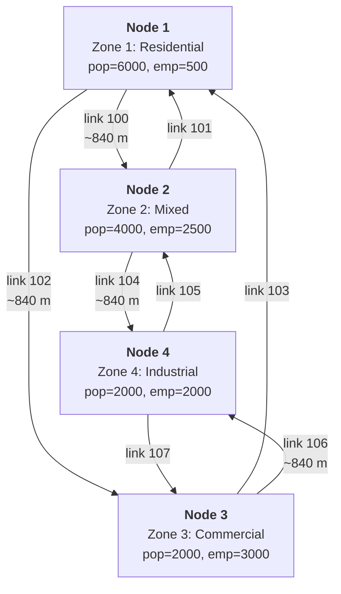

# multimodal

A multimodal city in memory: personal cars and public transit on one GMNS network. No external files needed.

The road side is identical to [`path_analysis_multi_class`](../path_analysis_multi_class/README.md): full 4-step pipeline, two user classes (car + truck), `store_paths`, OD path query and select link analysis. On top of it this example adds a public transit layer:

- six stops as GMNS `location` records pinned to the road links (the road graph itself is never modified);
- two bus lines and a tram line, each with a reverse twin;
- zone centroids as transit pseudo-stops connected to nearby stops by walk links - the assignment itself picks the access stop per destination;
- an exogenous transit OD assigned with the optimal strategies algorithm (Spiess & Florian, 1989) by the [hyperpaths-rs](https://crates.io/crates/hyperpaths-rs) crate.

Road demand comes from the 4-step pipeline; transit demand is a separate table (mode choice with a transit alternative is future work).

## Run

```sh
cargo run --example multimodal
```

## Road layer

4 intersection nodes arranged as a diamond, each serving as a zone centroid:

```text
       Zone 1 (residential)
              [1]
            /     \
         [3]       [2]
Zone 3 (commercial)  Zone 2 (mixed)
            \     /
              [4]
       Zone 4 (industrial)
```

Detailed view with link IDs and zone attributes
(if your Markdown viewer does not render mermaid format, just use https://mermaid.live live viewer/editor):



Each diamond edge is a pair of one-way road segment links (forward + reverse), giving 8 road links total, plus 8 connection links for turns. All road segments: 2 lanes, 60 km/h free speed, 1800 veh/h capacity.

## Transit layer

Both layers in one picture: the road diamond with the stop locations pinned to its links (`[..]` = intersection node, `o` = stop location at its offset, link IDs on the edges):

```text
                    [1]
              102 /     \ 100
             821 o       o 811
                 |       |
             823 o       o 812
                 |       |
               [3]       [2]
                 |       |
             824 o       o 814
              106 \     / 104
                   \   /
                    [4]

      west side:                 east side:
      tram T1 (821-823-824)      bus B1 (811-812-814)
                                 bus B2 (811-814 express)
```

The chains read top to bottom: the eastern buses run [1] - 811 - 812 - [2] - 814 - [4] along links 100 and 104, the western tram runs [1] - 821 - 823 - [3] - 824 - [4] along links 102 and 106. The road graph itself contains none of this - the stops exist only as `location` records referencing the links.

### Stops as GMNS locations

The stops are `location` records: points on road links (`link_id` + `lr` offset from the reference node), the road graph knows nothing about them. Eastern side (links 100, 104) hosts the bus stops, western side (links 102, 106) the in-street tram stops. One platform per stop serves both directions here; a real model would split them per direction.

| Location | On link | Offset | Type | Near |
|----------|---------|--------|------|------|
| 811 | 100 (1 -> 2) | 100 m | bus_stop | zone 1 |
| 812 | 100 (1 -> 2) | 700 m | bus_stop | zone 2 |
| 814 | 104 (2 -> 4) | 750 m | bus_stop | zone 4 |
| 821 | 102 (1 -> 3) | 100 m | tram_stop | zone 1 |
| 823 | 102 (1 -> 3) | 700 m | tram_stop | zone 3 |
| 824 | 106 (3 -> 4) | 750 m | tram_stop | zone 4 |

### Lines

| Line | Stops | Segments (min) | Headway (min) | Note |
|------|-------|----------------|---------------|------|
| B1 | 811 -> 812 -> 814 | 6, 7 | 6 | local bus, east |
| B2 | 811 -> 814 | 11 | 12 | express bus, east |
| T1 | 821 -> 823 -> 824 | 5, 5 | 8 | tram, west |

Each line has a reverse twin (`B1r`, `B2r`, `T1r`) with the same times, because a `TransitRoute` is one-way. B1 and B2 share stops 811 and 814, so a zone 1 -> zone 4 passenger faces the classic Spiess-Florian situation: wait for whichever attractive bus comes first.

### Zone access

Zone centroids (901-904) join the transit graph as pseudo-stops via walk links (both directions, minutes). Zones 1 and 4 reach both sides of the network:

```text
                  (901) zone 1
                 /            \
            walk 4.0        walk 3.0
               /                \
           [821]               [811] ---- B2: 11 ----+
             |                   |                    \
           T1: 5               B1: 6                   \
             |                   |                      |
           [823] -2.0- (903)   [812] -2.0- (902)        |
             |                   |                      |
           T1: 5               B1: 7                    |
             |                   |                      /
           [824]               [814] <-----------------+
               \                /
            walk 3.0        walk 2.0
                 \            /
                  (904) zone 4
```

There is no "assign the zone to its nearest stop" step: the centroid is connected to several candidate stops and phase 1 of the algorithm decides which of them is actually used, separately for every destination.

### Transit demand (passengers/hour)

| From | To | Trips |
|------|----|-------|
| 901 (zone 1) | 904 (zone 4) | 600 |
| 904 (zone 4) | 901 (zone 1) | 400 |
| 901 (zone 1) | 903 (zone 3) | 300 |
| 902 (zone 2) | 904 (zone 4) | 200 |
| 903 (zone 3) | 901 (zone 1) | 150 |

Total: 1650 trips.

## The transit algorithm, step by step

`assign_transit` expands every line into boarding links (stop -> route node, frequency = 1/headway), riding links (route node -> route node) and alighting links (route node -> stop, instant), adds the walk links, then runs the two phases of the algorithm per destination. See the [`transit`](../transit/README.md) example for the paper's own network traced against Tables 2 and 3; here is the trace for destination 904 (zone 4), the richest one.

Phase 1 (backward from 904, only the meaningful acceptances):

| # | Event | Update | Interpretation |
|---|-------|--------|----------------|
| 1 | walk 814 -> 904 (2.0, no wait) | `u_814 = 2` | leaving from 814, you walk home |
| 2 | walk 824 -> 904 (3.0, no wait) | `u_824 = 3` | same for the tram side |
| 3 | riding/alighting chains | `u(B1@812) = 7 + 2 = 9`, `u(B2@811) = 11 + 2 = 13`, `u(B1@811) = 6 + 9 = 15`, `u(T1@823) = 5 + 3 = 8`, `u(T1@821) = 5 + 8 = 13` | on-board times propagate through the route nodes |
| 4 | board B1 at 812 (f = 1/6) | `u_812 = 6 + 9 = 15` | zone 2 passengers wait for B1 only |
| 5 | board B2 at 811 (f = 1/12, key 13) | `u_811 = 12 + 13 = 25` | express alone: long headway dominates |
| 6 | board B1 at 811 (f = 1/6, key 15) | `u_811 = (25/12 + 15/6) / (1/4) = 18.33` | B1 joins the basket: waiting for either of the two beats committing to the express, even though the express rides faster |
| 7 | board T1 at 823 (f = 1/8) | `u_823 = 8 + 8 = 16` | |
| 8 | board T1 at 821 (f = 1/8, key 13) | `u_821 = 8 + 13 = 21` | |
| 9 | walk 901 -> 811 (3.0, key 18.33 + 3) | `u_901 = 21.33` | zone 1 goes to the bus stop... |
| 10 | walk 901 -> 821 (4.0, key 21 + 4 = 25) | rejected: `21.33 < 25` | ...and the tram access is examined and rejected - this is the per-destination access choice |

Boarding links of the reverse lines (B1r, B2r, T1r) are also examined for this destination and rejected: riding away from 904 cannot improve any label. Their keys equal the current stop labels exactly (boarding costs 0, and the reverse route node gets its label through its own 0-cost alighting link), which is why the solver accepts a link only on strict improvement - accepting at equality would create a zero-cost board-alight cycle and phase 2 would strand flow in it. See the acceptance test discussion in [hyperpaths-rs](https://crates.io/crates/hyperpaths-rs).

Phase 2 (loading, reverse acceptance order), demand 600 from 901 and 200 from 902:

1. Walk 901 -> 811 carries all 600: the strategy uses only the bus access for this destination.
2. At 811 the volume splits proportionally to frequencies: B1 gets `(1/6)/(1/4) * 600 = 400`, B2 gets `(1/12)/(1/4) * 600 = 200`.
3. Walk 902 -> 812 brings 200, they board B1 (the only attractive line at 812).
4. B1 rides 812 -> 814 with `400 + 200 = 600` on board; B2 arrives with 200; both alight at 814 and 800 walk into zone 4. Everything that left arrived: flow is conserved.

For destination 903 the picture flips: the east side has no path to zone 3 at all, so `u_901 = 4 + 15 = 19` via the tram (4 walk + 8 wait + 5 ride + 2 walk) and the 300 zone 1 -> zone 3 passengers use the *other* access stop. Same origin, different destinations, different access stops - no nearest-stop heuristic could produce this.

## Transit results

Expected travel times (walk + wait + ride):

| OD | Minutes | Breakdown |
|----|---------|-----------|
| 901 -> 904 | 21.33 | 3 walk + 18.33 (B1/B2 basket at 811) |
| 904 -> 901 | 21.33 | 2 walk + 19.33 (B1r/B2r basket at 814) |
| 901 -> 903 | 19.00 | 4 walk + 8 wait + 5 ride + 2 walk |
| 903 -> 901 | 19.00 | mirror of the above |
| 902 -> 904 | 17.00 | 2 walk + 6 wait + 7 ride + 2 walk |

Riding volumes:

| Line | Segment | Passengers |
|------|---------|------------|
| B1 | 811 -> 812 | 400.0 |
| B1 | 812 -> 814 | 600.0 |
| B2 | 811 -> 814 | 200.0 |
| B1r | 814 -> 812 -> 811 | 266.7 |
| B2r | 814 -> 811 | 133.3 |
| T1 | 821 -> 823 | 300.0 |
| T1r | 823 -> 821 | 150.0 |

Observations:

- **Frequency split.** 600 zone 1 -> zone 4 passengers split 400/200 between B1 and B2 - exactly the 2:1 ratio of their frequencies (1/6 vs 1/12). Same at 814 in the reverse direction: 266.7/133.3.
- **Access choice per destination.** Zone 1 sends 600 passengers to the bus stop (811) and 300 to the tram stop (821), because their destinations differ.
- **Conservation.** Arrivals: 800 into zone 4, 550 into zone 1, matching the demand column sums.

## Road results (unchanged from path_analysis_multi_class)

The transit layer does not touch the road assignment - all numbers below match [`path_analysis_multi_class`](../path_analysis_multi_class/README.md), where they are derived step by step.

| Step | Result |
|------|--------|
| Trip generation | P=[3050, 2250, 1300, 1200], A=[1000, 2400, 2600, 1800] |
| Trip distribution | 7800 total trips, Furness converges in 5 iterations |
| Mode choice | Auto: 5692 (73%), Bike: 1787 (23%), Walk: 320 (4%) |
| Assignment | multi-class FW, 4 iterations cold start, PCU total 8795 |
| Path analysis | 24 paths (12 OD pairs x 2 classes), car/truck flows 9:1 |
| Select link 102 | 6 OD-class pairs, 2103.2 PCU through the link |

## Difference from path_analysis_multi_class

Three additions, all in `main.rs`:

```rust
// 1. Stops pinned to road links inside build_network()
net.add_location(
    Location::new(STOP_Z1_EAST, road_links[&(1, 2)], 1, 100.0)
        .with_loc_type("bus_stop")
        .build(),
)?;

// 2. The transit layer over the stop locations
let mut net = TransitNetwork::new();
net.add_route(TransitRoute::new(
    "B1",
    vec![STOP_Z1_EAST, STOP_Z2, STOP_Z4_EAST],
    vec![6.0, 7.0],
    6.0,
));
// ... 5 more routes, then centroid access:
net.add_walk_link(CENTROID_Z1, STOP_Z1_EAST, 3.0);

// 3. Assignment over the centroid OD
let transit = assign_transit(&transit_network, &transit_od)?;
```

The road pipeline is byte-for-byte the same; the two assignments share only the `location` records that pin the stops to the links.

## References

- Spiess, H. and Florian, M. (1989) "Optimal strategies: A new assignment model for transit networks". Transportation Research Part B 23(2), 83-102. DOI: [10.1016/0191-2615(89)90034-9](https://doi.org/10.1016/0191-2615(89)90034-9)
- GMNS `location` table: https://github.com/zephyr-data-specs/GMNS/blob/develop/docs/spec/location.md
- [`transit`](../transit/README.md) - the paper's network traced against its Tables 2 and 3
- [`transit_gtfs`](../transit_gtfs/README.md) - the same chain driven by a GTFS dataset
- [`path_analysis_multi_class`](../path_analysis_multi_class/README.md) - the road side of this example, explained in full
