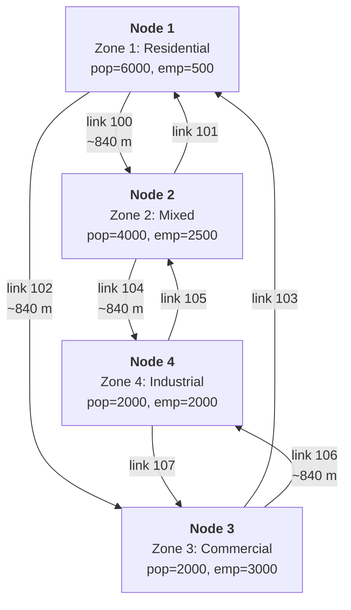

# path_analysis_multi_class

In-memory 4-zone diamond network with multi-class assignment and path analysis.
No external files needed.

Identical to [`simple_network`](../simple_network/README.md) except the config
includes two user classes (car + truck) and `store_paths = true`. Combines the
features of [`multiclass_network`](../multiclass_network/README.md) and
[`path_analysis_single_class`](../path_analysis_single_class/README.md).

After assignment, per-OD per-class shortest paths are extracted, then two
path analysis demos run:
1. OD pair query: the shortest route from Zone 1 to Zone 4, per class.
2. Select link analysis: which OD pairs (per class) use link 102 (1->3).

## Run

```sh
cargo run --example path_analysis_multi_class
```

## Network topology

4 intersection nodes arranged as a diamond, each serving as a zone centroid:

```text
       Zone 1 (residential)
         |
    [1]--+--[2]
     |         |
Zone 2         Zone 3
(mixed)        (commercial)
     |         |
    [3]--+--[4]
         |
       Zone 4 (industrial)
```

Detailed view with link IDs and zone attributes
(if your Markdown viewer does not render mermaid format, just use https://mermaid.live live viewer/editor):



Each diamond edge is a pair of one-way road segment links (forward + reverse),
giving 8 road links total. At each intersection, connection links allow all
turns except U-turns (8 connection links total). Total: 16 links.

All road segments: 2 lanes, 60 km/h free speed, 1800 veh/h capacity.
Connection links: 10 m length, 30 km/h, 1800 veh/h.

## Zones

| Zone | Name               | Population | Employment |
|------|--------------------|------------|------------|
| 1    | Residential North  | 6000       | 500        |
| 2    | Mixed East         | 4000       | 2500       |
| 3    | Commercial West    | 2000       | 3000       |
| 4    | Industrial South   | 2000       | 2000       |

**Total:** pop=14000, emp=8000.

## Model parameters

**Trip generation** - regression with default coefficients:
- Production: $P_i = 0.5 \cdot pop_i + 0.1 \cdot emp_i$
- Attraction: $A_i = 0.1 \cdot pop_i + 0.8 \cdot emp_i$

The ratio $P_{total} / E_{total} = 1.75$ ensures balanced totals
(required for Furness/IPF convergence):

$$\sum P_i = \sum A_i = 7800$$

**Trip distribution** - gravity model with exponential impedance:

$$f(t) = e^{-0.1 \cdot t}$$

Furness (IPF) balancing with default tolerance ($10^{-6}$, max 100 iterations).

**Mode choice** - multinomial logit with 3 modes:

| Mode | ASC  | Time coeff |
|------|------|------------|
| Auto | 0.0  | -0.03      |
| Bike | -1.0 | -0.05      |
| Walk | -2.0 | -0.08      |

**Assignment** - multi-class Frank-Wolfe, max 50 iterations, convergence
gap $10^{-4}$, BPR function with default $\alpha=0.15$, $\beta=4.0$,
`store_paths = true`.

**Feedback** - 3 iterations (assignment costs update skim for next distribution/mode choice pass).

### Multi-class configuration

The AUTO OD matrix from mode choice is split into two user classes:

| Class | PCU factor | ff_time_multiplier | Demand fraction |
|-------|------------|-------------------|-----------------|
| car   | 1.0        | 1.0               | 0.9 (90%)       |
| truck | 2.5        | 2.5               | 0.1 (10%)       |

The Beckmann symmetry condition holds ($ff\_mult_m / pcu_m = const$ for all m),
so all classes share the same shortest path tree (SPT). This means per-class
path extraction runs Dijkstra once per origin, not once per origin per class.
See [`multiclass_network`](../multiclass_network/README.md) for the full
multi-class formulation.

## Results

All output is structured JSON via `tracing`, plus plain text for path analysis.

### Steps 1-3: Trip generation, distribution, mode choice

Identical to `simple_network` and `multiclass_network` - see those READMEs
for the full step-by-step derivation.

| Step | Result |
|------|--------|
| Trip generation | P=[3050, 2250, 1300, 1200], A=[1000, 2400, 2600, 1800] |
| Trip distribution | 7800 total trips, Furness converges in 5 iterations |
| Mode choice | Auto: 5692 (73%), Bike: 1787 (23%), Walk: 320 (4%) |

### Step 4: Multi-class traffic assignment

The AUTO OD (5692 trips) is split:
- Car OD = 0.9 * AUTO OD = 5123 trips
- Truck OD = 0.1 * AUTO OD = 569 trips

Multi-class FW converges in **4 iterations** (cold start) with gap $8.0 \times 10^{-5}$.
After convergence, `store_paths = true` triggers post-processing:
Dijkstra runs from each origin zone on the final equilibrium costs,
extracting the shortest path to each destination for each class.

Under the Beckmann symmetry condition, the SPT is shared across classes.
Dijkstra runs once per origin (not M times), and each class gets the same
path with different costs: $c_a^m = ff\_mult_m \cdot t_a(V_a)$.

This gives **24 paths** total (12 OD pairs x 2 classes).

#### Per-class results

| Class | Total veh-trips | PCU contribution |
|-------|-----------------|------------------|
| car   | 6883            | 6883 * 1.0 = 6883 |
| truck | 765             | 765 * 2.5 = 1912 |
| **PCU total** | | **8795** |

#### Final link volumes (PCU)

| Link | Direction | PCU volume | Cost (hours) | V/C ratio |
|------|-----------|------------|--------------|-----------|
| 102  | 1 -> 3    | 1555       | 0.0140       | 0.43      |
| 104  | 2 -> 4    | 1444       | 0.0140       | 0.40      |
| 100  | 1 -> 2    | 1353       | 0.0140       | 0.38      |
| 106  | 3 -> 4    | 1156       | 0.0140       | 0.32      |
| 107  | 4 -> 3    | 1141       | 0.0140       | 0.32      |
| 105  | 4 -> 2    | 953        | 0.0140       | 0.26      |
| 101  | 2 -> 1    | 746        | 0.0140       | 0.21      |
| 103  | 3 -> 1    | 448        | 0.0140       | 0.12      |

### Path analysis

24 paths total: one per OD pair per class.

#### OD pair query: Zone 1 -> Zone 4

Per-class shortest routes from residential zone 1 to industrial zone 4:

| Class | Flow (veh) | Cost (h) | Links | Route |
|-------|-----------|----------|-------|-------|
| car   | 479.3     | 0.0280   | 102 -> 106 | via zone 3 |
| truck | 53.3      | 0.0700   | 102 -> 106 | via zone 3 |

Key observations:

- **Same path, different costs.** Both classes take the same route [102, 106]
  because the SPT is shared. The truck cost is 2.5x the car cost
  (0.0700 / 0.0280 = 2.5), matching the `ff_time_multiplier` ratio.

- **Demand ratio preserved.** Car flow / truck flow = 479.3 / 53.3 = 9.0,
  matching the 90%/10% demand split.

- **Route differs from single-class.** The single-class
  [`path_analysis_single_class`](../path_analysis_single_class/README.md) example picks route [100, 104] (via zone 2)
  for the same OD pair. The multi-class PCU loading shifts the cost balance,
  making the route via zone 3 cheaper at equilibrium.

For multiple paths per OD pair (alternative routes with flow distribution),
use Gradient Projection instead of Frank-Wolfe.

#### Select link analysis: link 102 (1 -> 3)

Which OD pairs (per class) route through link 102?

| Origin | Dest | Class | Flow through link | Total OD flow |
|--------|------|-------|-------------------|---------------|
| 1      | 3    | car   | 711.4             | 711.4         |
| 2      | 3    | car   | 702.1             | 702.1         |
| 1      | 4    | car   | 479.3             | 479.3         |
| 1      | 3    | truck | 79.0              | 79.0          |
| 2      | 3    | truck | 78.0              | 78.0          |
| 1      | 4    | truck | 53.3              | 53.3          |
| **Total** | | | **2103.2**       | **6 OD-class pairs** |

Compared to [`path_analysis_single_class`](../path_analysis_single_class/README.md) (where only OD 1->3 used link 102),
the multi-class assignment routes more OD pairs through this link. The higher
PCU loading from trucks shifts the equilibrium, making link 102 relatively
attractive for additional OD pairs (2->3 and 1->4).

The per-class breakdown shows that truck flows are ~1/9 of car flows on
every OD pair, consistent with the 10%/90% demand split.

### Convergence summary

| Feedback iter | FW iters | FW gap  | Warm start |
|---------------|----------|---------|------------|
| 1             | 4        | 8.0e-5  | no (cold)  |
| 2             | 2        | 4.0e-5  | yes        |
| 3             | 1        | 4.1e-5  | yes        |

### Timings

| Step           | Time (ms) |
|----------------|-----------|
| Generation     | 0.001     |
| Distribution   | 2.140     |
| Mode choice    | 0.138     |
| Assignment     | 3.106     |
| **Total**      | **7.719** |

---

## Benchmark results

Grid 50x50: 625 zones, 2500 nodes, 4900 edges (9800 links, 2 per edge).
FW, max 20 iterations, gap=1e-3, 1 feedback iteration.

### Time

| Variant | Without paths | With paths | Overhead |
|---------|---------------|------------|----------|
| Single-class | 729 ms | 1022 ms | **+40%** |
| Multi-class (2 classes) | 1056 ms | 1499 ms | **+42%** |

Overhead is one Dijkstra per origin (625 runs) after convergence.
Multi-class does not add extra Dijkstra runs (shared SPT) - same ~40% overhead as single-class.

### Memory

| Variant | Paths | sizeof(OdPath) | Structs | Heap (link_ids) | Total |
|---------|-------|----------------|---------|-----------------|-------|
| Single-class | 390,000 | 64 B | 23.8 MB | 99.3 MB | **123.1 MB** |
| Multi-class (2 cls) | 780,000 | 64 B | 47.6 MB | 199.3 MB | **246.9 MB** |

Avg 33.4 links/path. Heap dominates (80%): `Vec<LinkID>` contents (33.4 * 8 B = 267 B/path on heap vs 64 B struct inline).
Multi-class is x2 paths (one per class), no extra per-struct overhead thanks to `Option<u16>` (vs `Option<String>` which would add 24 B/path).

See also: [`path_analysis_single_class`](../path_analysis_single_class/README.md) for single-class benchmarks,
[`diagonalization`](../diagonalization/README.md) for per-class VDF benchmarks.

---

## Difference from simple_network

Two extra lines in the config builder:

```rust
// simple_network
let config = ModelConfig::new()
    .with_assignment_method(AssignmentMethodType::FrankWolfe)
    .with_max_iterations(50)
    .with_convergence_gap(1e-4)
    .with_feedback_iterations(3)
    .with_verbose_level(VerboseLevel::Main)
    .build();

// path_analysis_multi_class - two extra lines
let config = ModelConfig::new()
    .with_assignment_method(AssignmentMethodType::FrankWolfe)
    .with_max_iterations(50)
    .with_convergence_gap(1e-4)
    .with_feedback_iterations(3)
    .with_verbose_level(VerboseLevel::Main)
    .with_store_paths(true)
    .with_user_classes(vec![
        UserClassConfig::new("car", 1.0, 1.0, 0.9),
        UserClassConfig::new("truck", 2.5, 2.5, 0.1),
    ])
    .build();
```

Network, zones, trip generation, distribution, mode choice - all identical.
The pipeline detects `user_classes` in the config and switches to multi-class
assignment. The `store_paths` flag triggers per-OD per-class path extraction
after assignment converges. Each path carries a `class_index` field
(`Some(0)` = car, `Some(1)` = truck) for filtering in analysis queries.
