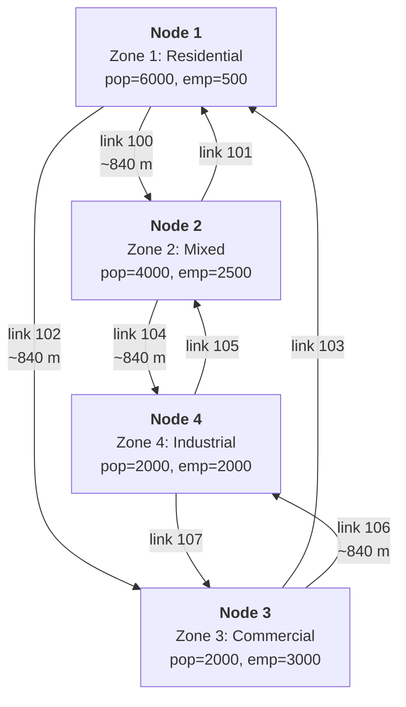

# path_analysis_single_class

In-memory 4-zone diamond network with path analysis.
No external files needed.

Identical to [`simple_network`](../simple_network/README.md) except:
- `store_paths = true` - after assignment, per-OD shortest paths are extracted.
- After the pipeline, two path analysis demos run:
  1. OD pair query: the shortest route from Zone 1 to Zone 4.
  2. Select link analysis: which OD pairs use link 102 (1->3).

## Run

```sh
cargo run --example path_analysis_single_class
```

## Network topology

4 intersection nodes arranged as a diamond, each serving as a zone centroid:

```text
       Zone 1 (residential)
         |
    [1]--+--[2]
     |         |
Zone 2         Zone 3
(mixed)        (commercial)
     |         |
    [3]--+--[4]
         |
       Zone 4 (industrial)
```

Detailed view with link IDs and zone attributes
(if your Markdown viewer does not render mermaid format, just use https://mermaid.live live viewer/editor):



Each diamond edge is a pair of one-way road segment links (forward + reverse),
giving 8 road links total. At each intersection, connection links allow all
turns except U-turns (8 connection links total). Total: 16 links.

All road segments: 2 lanes, 60 km/h free speed, 1800 veh/h capacity.
Connection links: 10 m length, 30 km/h, 1800 veh/h.

## Zones

| Zone | Name               | Population | Employment |
|------|--------------------|------------|------------|
| 1    | Residential North  | 6000       | 500        |
| 2    | Mixed East         | 4000       | 2500       |
| 3    | Commercial West    | 2000       | 3000       |
| 4    | Industrial South   | 2000       | 2000       |

**Total:** pop=14000, emp=8000.

## Model parameters

**Trip generation** - regression with default coefficients:
- Production: $P_i = 0.5 \cdot pop_i + 0.1 \cdot emp_i$
- Attraction: $A_i = 0.1 \cdot pop_i + 0.8 \cdot emp_i$

The ratio $P_{total} / E_{total} = 1.75$ ensures balanced totals
(required for Furness/IPF convergence):

$$\sum P_i = \sum A_i = 7800$$

**Trip distribution** - gravity model with exponential impedance:

$$f(t) = e^{-0.1 \cdot t}$$

Furness (IPF) balancing with default tolerance ($10^{-6}$, max 100 iterations).

**Mode choice** - multinomial logit with 3 modes:

| Mode | ASC  | Time coeff |
|------|------|------------|
| Auto | 0.0  | -0.03      |
| Bike | -1.0 | -0.05      |
| Walk | -2.0 | -0.08      |

**Assignment** - Frank-Wolfe, max 50 iterations, convergence gap $10^{-4}$,
BPR function with default $\alpha=0.15$, $\beta=4.0$, `store_paths = true`.

**Feedback** - 3 iterations (assignment costs update skim for next distribution/mode choice pass).

## Results

All output is structured JSON via `tracing`, plus plain text for path analysis.

### Steps 1-3: Trip generation, distribution, mode choice

Identical to `simple_network` - see that README for the full step-by-step
derivation.

| Step | Result |
|------|--------|
| Trip generation | P=[3050, 2250, 1300, 1200], A=[1000, 2400, 2600, 1800] |
| Trip distribution | 7800 total trips, Furness converges in 5 iterations |
| Mode choice | Auto: 5692 (73%), Bike: 1787 (23%), Walk: 320 (4%) |

### Step 4: Traffic assignment (Frank-Wolfe)

Same algorithm and parameters as `simple_network`. FW converges in
**4 iterations** with relative gap $4.5 \times 10^{-5}$.

After convergence, `store_paths = true` triggers post-processing:
Dijkstra runs from each origin zone on the final equilibrium costs,
extracting the shortest path to each destination. This gives one path
per OD pair with the full OD demand as flow.

#### Final link volumes

Identical to `simple_network`:

| Link | Direction | Volume (veh) | Cost (hours) | V/C ratio |
|------|-----------|--------------|--------------|-----------|
| 102  | 1 -> 3    | 1378.7       | 0.0140       | 0.38      |
| 104  | 2 -> 4    | 1229.1       | 0.0140       | 0.34      |
| 100  | 1 -> 2    | 1150.2       | 0.0140       | 0.32      |
| 106  | 3 -> 4    | 1031.4       | 0.0140       | 0.29      |
| 107  | 4 -> 3    | 983.7        | 0.0140       | 0.27      |
| 105  | 4 -> 2    | 836.3        | 0.0140       | 0.23      |
| 101  | 2 -> 1    | 656.9        | 0.0140       | 0.18      |
| 103  | 3 -> 1    | 381.7        | 0.0140       | 0.11      |

### Path analysis

FW stores 12 paths total (one per OD pair with positive demand).
This section demonstrates two analysis queries.

#### OD pair query: Zone 1 -> Zone 4

The shortest route from residential zone 1 to industrial zone 4:

| Path | Flow (veh) | Cost (h) | Links |
|------|-----------|----------|-------|
| #0   | 532.6     | 0.0280   | 100 -> 104 (via zone 2) |

Dijkstra picks the route via zone 2 (left side of the diamond).
The alternative via zone 3 (links 102 -> 106) has the same cost at
free-flow, but at equilibrium link 102 carries slightly more traffic
(V/C=0.38 vs 0.34 for link 100), making the left-side route marginally
cheaper.

For multiple paths per OD pair (alternative routes with flow distribution),
use Gradient Projection instead of Frank-Wolfe.

#### Select link analysis: link 102 (1 -> 3)

Which OD pairs route through link 102?

| Origin | Dest | Flow through link | Total OD flow |
|--------|------|-------------------|---------------|
| 1      | 3    | 790.5             | 790.5         |
| **Total** | | **790.5**        | **1 OD pair** |

At equilibrium, only the direct OD pair 1->3 uses link 102.
The 2-hop flows (2->3 and 1->4) that would go via node 1 or node 3
in the initial AoN are redistributed to alternative routes after
Frank-Wolfe equilibration.

On a larger network with more distinct routes, select link analysis
reveals which origin-destination pairs contribute to a bottleneck,
enabling targeted interventions (capacity expansion, demand management,
or new route alternatives).

### Convergence summary

| Feedback iter | FW iters | FW gap  | Warm start |
|---------------|----------|---------|------------|
| 1             | 4        | 4.5e-5  | no (cold)  |
| 2             | 1        | 5.9e-5  | yes        |
| 3             | 1        | 5.9e-5  | yes        |

### Timings

| Step           | Time (ms) |
|----------------|-----------|
| Generation     | 0.000     |
| Distribution   | 1.074     |
| Mode choice    | 0.145     |
| Assignment     | 0.595     |
| **Total**      | **2.753** |

---

## Benchmark results

Grid 50x50: 625 zones, 2500 nodes, 4900 edges (9800 links, 2 per edge).
FW, max 20 iterations, gap=1e-3, 1 feedback iteration.

### Time

| Variant | Without paths | With paths | Overhead |
|---------|---------------|------------|----------|
| Single-class | 729 ms | 1022 ms | **+40%** |

Overhead is one Dijkstra per origin (625 runs) after convergence.

### Memory

| Variant | Paths | sizeof(OdPath) | Structs | Heap (link_ids) | Total |
|---------|-------|----------------|---------|-----------------|-------|
| Single-class | 390,000 | 64 B | 23.8 MB | 99.3 MB | **123.1 MB** |

Avg 33.4 links/path. Heap dominates (80%): `Vec<LinkID>` contents (33.4 * 8 B = 267 B/path on heap vs 64 B struct inline).

See also: [`path_analysis_multi_class`](../path_analysis_multi_class/README.md) for multi-class benchmarks on the same grid.

---

## Difference from simple_network

The **only code difference** is in the config builder:

```rust
// simple_network
let config = ModelConfig::new()
    .with_assignment_method(AssignmentMethodType::FrankWolfe)
    .with_max_iterations(50)
    .with_convergence_gap(1e-4)
    .with_feedback_iterations(3)
    .with_verbose_level(VerboseLevel::Main)
    .build();

// path_analysis_single_class - one extra line
let config = ModelConfig::new()
    .with_assignment_method(AssignmentMethodType::FrankWolfe)
    .with_max_iterations(50)
    .with_convergence_gap(1e-4)
    .with_feedback_iterations(3)
    .with_verbose_level(VerboseLevel::Main)
    .with_store_paths(true)
    .build();
```

Network, zones, trip generation, distribution, mode choice - all identical.
The pipeline detects `store_paths` in the config and extracts per-OD
shortest paths after assignment converges.
