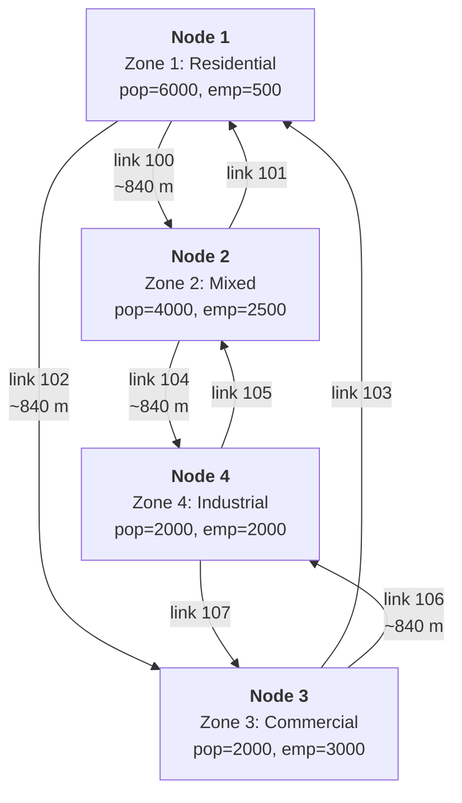
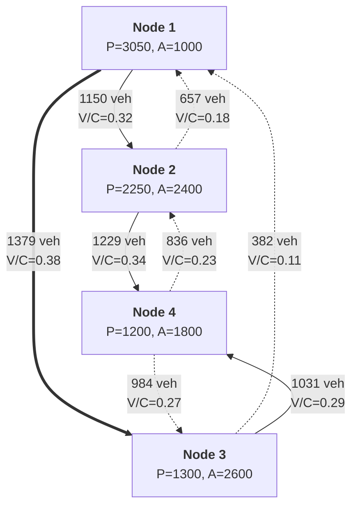

# simple_network

In-memory 4-zone diamond network with full pipeline execution.
No external files needed.

## Run

```sh
cargo run --example simple_network
```

## Network topology

4 intersection nodes arranged as a diamond, each serving as a zone centroid:

```text
       Zone 1 (residential)
         |
    [1]--+--[2]
     |         |
Zone 2         Zone 3
(mixed)        (commercial)
     |         |
    [3]--+--[4]
         |
       Zone 4 (industrial)
```

Detailed view with link IDs and zone attributes
(if your Markdown viewer does not render mermaid format, just use https://mermaid.live live viewer/editor):



Each diamond edge is a pair of one-way road segment links (forward + reverse),
giving 8 road links total. At each intersection, connection links allow all
turns except U-turns (8 connection links total). Total: 16 links.

All road segments: 2 lanes, 60 km/h free speed, 1800 veh/h capacity.
Connection links: 10 m length, 30 km/h, 1800 veh/h.

Assignment results on the graph (volume / capacity per link):



The thick arrow (1->3, 1379 veh) is the most loaded link - the main
commute corridor from residential zone 1 to commercial zone 3.
Dashed arrows show lighter reverse flows.

## Zones

| Zone | Name               | Population | Employment |
|------|--------------------|------------|------------|
| 1    | Residential North  | 6000       | 500        |
| 2    | Mixed East         | 4000       | 2500       |
| 3    | Commercial West    | 2000       | 3000       |
| 4    | Industrial South   | 2000       | 2000       |

**Total:** pop=14000, emp=8000.

## Model parameters

**Trip generation** - regression with default coefficients:
- Production: $P_i = 0.5 \cdot pop_i + 0.1 \cdot emp_i$
- Attraction: $A_i = 0.1 \cdot pop_i + 0.8 \cdot emp_i$

The ratio $P_{total} / E_{total} = 1.75$ ensures balanced totals
(required for Furness/IPF convergence):

$$\sum P_i = \sum A_i = 7800$$

**Trip distribution** - gravity model with exponential impedance:

$$f(t) = e^{-0.1 \cdot t}$$

Furness (IPF) balancing with default tolerance ($10^{-6}$, max 100 iterations).

**Mode choice** - multinomial logit with 3 modes:

| Mode | ASC  | Time coeff |
|------|------|------------|
| Auto | 0.0  | -0.03      |
| Bike | -1.0 | -0.05      |
| Walk | -2.0 | -0.08      |

**Assignment** - Frank-Wolfe, max 50 iterations, convergence gap $10^{-4}$,
BPR function with default $\alpha=0.15$, $\beta=4.0$.

**Feedback** - 3 iterations (assignment costs update skim for next distribution/mode choice pass).

## Results

All output is structured JSON via `tracing`.

### Step 1: Trip generation

| Zone | Name              | Productions | Attractions |
|------|-------------------|-------------|-------------|
| 1    | Residential North | 3050        | 1000        |
| 2    | Mixed East        | 2250        | 2400        |
| 3    | Commercial West   | 1300        | 2600        |
| 4    | Industrial South  | 1200        | 1800        |
| **Total** |              | **7800**    | **7800**    |

Zone 1 is the biggest trip producer (large population, few jobs),
while zones 3 and 4 are the biggest attractors (employment-heavy).
This matches the expected commute pattern: people live in zone 1
and travel to zones 3-4 for work.

### Step 2: Trip distribution

Gravity model with Furness balancing converges in 5 IPF iterations.
Total distributed trips = 7800 (matches generation totals exactly).

The exponential impedance $f(t) = e^{-0.1t}$ penalizes long trips.
On this small network all zones are ~1 km apart, so impedance
differences are small and trips distribute fairly evenly.

### Step 3: Mode choice

| Mode | Trips | Share |
|------|-------|-------|
| Auto | 5692  | 73.0% |
| Bike | 1787  | 22.9% |
| Walk | 320   | 4.1%  |

Auto dominates because it has the best ASC (0.0 vs -1.0 for bike, -2.0 for walk)
and the smallest time penalty coefficient (-0.03 vs -0.05, -0.08).
Walk share is low because the time penalty coefficient is steep (-0.08)
and walking at 5 km/h produces long travel times even on short distances.

### Step 4: Traffic assignment

Frank-Wolfe converges in **4 iterations** with relative gap $4.5 \times 10^{-5}$
(below the $10^{-4}$ threshold).

Top loaded links (5692 auto trips assigned to 8 road links).
Total capacity per link = 1800 veh/h/lane * 2 lanes = 3600 veh/h:

| Link | Direction | Volume (veh) | Cost (hours) | V/C ratio |
|------|-----------|--------------|--------------|-----------|
| 102  | 1 -> 3    | 1378.6       | 0.0140       | 0.38      |
| 104  | 2 -> 4    | 1229.1       | 0.0140       | 0.34      |
| 100  | 1 -> 2    | 1150.2       | 0.0140       | 0.32      |
| 106  | 3 -> 4    | 1031.4       | 0.0140       | 0.29      |
| 107  | 4 -> 3    | 983.7        | 0.0140       | 0.27      |
| 105  | 4 -> 2    | 836.3        | 0.0140       | 0.23      |
| 101  | 2 -> 1    | 656.9        | 0.0140       | 0.18      |
| 103  | 3 -> 1    | 381.7        | 0.0140       | 0.11      |

V/C ratios are very low (0.11-0.38) - the network has excess capacity
for this demand level. The BPR function adds virtually no delay:
free-flow time for ~840 m at 60 km/h is 0.014 h, and observed cost
is the same 0.014 h (congestion adds less than 0.3%).

This is expected: 5692 auto trips spread across 8 links with 3600 veh/h
each produces no meaningful congestion. To see BPR effects, you would
need to either reduce capacity (fewer lanes) or increase demand
(more population/employment).

Links 102 (1->3) and 104 (2->4) are the most loaded because they serve
the dominant flow from residential zone 1 toward employment zones 3 and 4.
Link 103 (3->1) is the least loaded - few people commute from commercial
zone 3 back to residential zone 1.

Connection links (108-115) carry zero volume because routing happens
at the link level - the assignment loads road segments, and connection
links serve only as topology connectors for turn permissions.

### Feedback convergence

3 feedback iterations were performed. The relative gap is stable
at $4.48 \times 10^{-5}$ across all iterations, meaning the skim
update has minimal impact on this small network. On larger networks
with congestion, feedback iterations would show the gap changing
as congested travel times shift distribution and mode choice.

### Timings

| Step           | Time (ms) |
|----------------|-----------|
| Generation     | 0.001     |
| Distribution   | 0.119     |
| Mode choice    | 0.553     |
| Assignment     | 7.823     |
| **Total**      | **8.996** |

Assignment dominates (87% of total time) because it runs Dijkstra
shortest paths on every iteration. Distribution and mode choice
are fast because the OD matrix is only 4x4.

---

## Step by step (for those who want to check it by hand)

This section walks through every formula and substitution in the
4-step model pipeline, as if you were computing with pen and paper.
All intermediate values are computed from the source code with full
floating-point precision; numbers shown here are rounded for readability.

### Step 0: Network geometry

4 nodes form a diamond with coordinates (WGS-84 degrees):

| Node | Latitude | Longitude |
|------|----------|-----------|
| 1    | 55.760   | 37.620    |
| 2    | 55.755   | 37.630    |
| 3    | 55.755   | 37.610    |
| 4    | 55.750   | 37.620    |

Haversine distances between adjacent nodes:

$$d = R \cdot 2 \cdot \arcsin\sqrt{\sin^2\frac{\Delta\phi}{2} + \cos\phi_1 \cos\phi_2 \sin^2\frac{\Delta\lambda}{2}}, \quad R = 6371 \text{ km}$$

Example for edge 1-2:

$$\Delta\phi = (55.755 - 55.760) \cdot \frac{\pi}{180} = -8.727 \times 10^{-5} \text{ rad}$$

$$\Delta\lambda = (37.630 - 37.620) \cdot \frac{\pi}{180} = 1.745 \times 10^{-4} \text{ rad}$$

$$a = \sin^2\!\left(\frac{-8.727 \times 10^{-5}}{2}\right) + \cos(55.760^\circ) \cdot \cos(55.755^\circ) \cdot \sin^2\!\left(\frac{1.745 \times 10^{-4}}{2}\right) = 4.307 \times 10^{-9}$$

$$d = 6371 \cdot 2 \cdot \arcsin\!\left(\sqrt{4.307 \times 10^{-9}}\right) = 6371 \cdot 1.313 \times 10^{-4} = 0.8370 \text{ km} = 837.0 \text{ m}$$

All four edges are nearly the same length due to the symmetric diamond layout:

| Edge | $\Delta\text{lat}$ | $\Delta\text{lon}$ | Distance |
|------|-----------|-----------|----------|
| 1-2  | -0.005    | +0.010    | 837.0 m  |
| 1-3  | -0.005    | -0.010    | 837.0 m  |
| 2-4  | -0.005    | -0.010    | 837.1 m  |
| 3-4  | -0.005    | +0.010    | 837.1 m  |

**Free-flow travel times:**

Road links (60 km/h):
$$t_0 = \frac{0.837 \text{ km}}{60 \text{ km/h}} = 0.01395 \text{ h} = 0.837 \text{ min}$$

Connection links (10 m, 30 km/h):
$$t_0 = \frac{0.010 \text{ km}}{30 \text{ km/h}} = 0.000333 \text{ h} = 0.020 \text{ min}$$

**Link capacities:**

Road links: $C = 1800 \text{ veh/h/lane} \times 2 \text{ lanes} = 3600 \text{ veh/h}$

Connection links: $C = 1800 \text{ veh/h}$ (single lane)

---

### Step 1: Trip generation

Runs once, independent of feedback iterations.

**Formulas** (default regression coefficients):
$$P_i = 0.5 \cdot \text{pop}_i + 0.1 \cdot \text{emp}_i$$
$$A_i = 0.1 \cdot \text{pop}_i + 0.8 \cdot \text{emp}_i$$

**Computation:**

Zone 1 (Residential North, pop=6000, emp=500):
$$P_1 = 0.5 \times 6000 + 0.1 \times 500 = 3000 + 50 = 3050$$
$$A_1 = 0.1 \times 6000 + 0.8 \times 500 = 600 + 400 = 1000$$

Zone 2 (Mixed East, pop=4000, emp=2500):
$$P_2 = 0.5 \times 4000 + 0.1 \times 2500 = 2000 + 250 = 2250$$
$$A_2 = 0.1 \times 4000 + 0.8 \times 2500 = 400 + 2000 = 2400$$

Zone 3 (Commercial West, pop=2000, emp=3000):
$$P_3 = 0.5 \times 2000 + 0.1 \times 3000 = 1000 + 300 = 1300$$
$$A_3 = 0.1 \times 2000 + 0.8 \times 3000 = 200 + 2400 = 2600$$

Zone 4 (Industrial South, pop=2000, emp=2000):
$$P_4 = 0.5 \times 2000 + 0.1 \times 2000 = 1000 + 200 = 1200$$
$$A_4 = 0.1 \times 2000 + 0.8 \times 2000 = 200 + 1600 = 1800$$

| Zone | pop  | emp  | $P_i$ | $A_i$ |
|------|------|------|-------|-------|
| 1    | 6000 | 500  | 3050  | 1000  |
| 2    | 4000 | 2500 | 2250  | 2400  |
| 3    | 2000 | 3000 | 1300  | 2600  |
| 4    | 2000 | 2000 | 1200  | 1800  |
| **Sum** | 14000 | 8000 | **7800** | **7800** |

Totals match: $\sum P_i = \sum A_i = 7800$.

Why they match: $\sum P = 0.5 \cdot 14000 + 0.1 \cdot 8000 = 7800$
and $\sum A = 0.1 \cdot 14000 + 0.8 \cdot 8000 = 7800$.
For any coefficients, the balance condition is $0.5P_{tot} + 0.1E_{tot} = 0.1P_{tot} + 0.8E_{tot}$,
which gives $0.4P_{tot} = 0.7E_{tot}$, i.e. $P_{tot}/E_{tot} = 1.75$.
Our data: $14000/8000 = 1.75$ -- exactly the required ratio.

---

### Feedback iteration 1

The pipeline runs steps 2-4 inside a feedback loop (3 iterations total).
Each iteration updates the travel time skim from congested assignment costs.

#### Step 2a: Initial skim from free-flow

Before the first assignment, the skim matrix is built from free-flow
link costs using Dijkstra's shortest path from each zone centroid.

**Shortest paths between all zone pairs:**

Adjacent zones (1 hop, direct link):

| OD  | Path     | Cost (h)  |
|-----|----------|-----------|
| 1->2 | link 100 (1->2) | 0.01395 |
| 1->3 | link 102 (1->3) | 0.01395 |
| 2->1 | link 101 (2->1) | 0.01395 |
| 2->4 | link 104 (2->4) | 0.01395 |
| 3->1 | link 103 (3->1) | 0.01395 |
| 3->4 | link 106 (3->4) | 0.01395 |
| 4->2 | link 105 (4->2) | 0.01395 |
| 4->3 | link 107 (4->3) | 0.01395 |

Non-adjacent zones (2 hops, via intermediate node + connection link):

| OD  | Path | Cost (h) |
|-----|------|----------|
| 1->4 | link 100 + conn@2 + link 104 | 0.01395 + 0.00033 + 0.01395 = 0.02824 |
| 2->3 | link 101 + conn@1 + link 102 | 0.01395 + 0.00033 + 0.01395 = 0.02823 |
| 3->2 | link 103 + conn@1 + link 100 | 0.01395 + 0.00033 + 0.01395 = 0.02823 |
| 4->1 | link 105 + conn@2 + link 101 | 0.01395 + 0.00033 + 0.01395 = 0.02824 |

Note: each non-adjacent pair has **two** equal-cost routes (e.g., 1->4
can go via node 2 or via node 3). Dijkstra picks one deterministically.
The total cost is the same either way.

**Skim matrix** $c_{ij}$ (hours):

|     | Z1    | Z2    | Z3    | Z4    |
|-----|-------|-------|-------|-------|
| Z1  | 0     | 0.01395 | 0.01395 | 0.02824 |
| Z2  | 0.01395 | 0   | 0.02823 | 0.01395 |
| Z3  | 0.01395 | 0.02823 | 0   | 0.01395 |
| Z4  | 0.02824 | 0.01395 | 0.01395 | 0     |

#### Step 2b: Trip distribution -- gravity model

**Impedance function:**

$$f(c) = e^{-\beta \cdot c}, \quad \beta = 0.1, \quad c \text{ in hours}$$

For adjacent zones ($c = 0.01395$ h):
$$f = e^{-0.1 \times 0.01395} = e^{-0.001395} = 0.99861$$

For non-adjacent zones ($c = 0.02824$ h):
$$f = e^{-0.1 \times 0.02824} = e^{-0.002824} = 0.99718$$

Both values are extremely close to 1.0 because the travel times are tiny
(sub-minute). The impedance barely distinguishes between near and far zones.

**Gravity model seed matrix:**

$$T_{ij}^{(0)} = P_i \cdot \frac{A_j \cdot f(c_{ij})}{\sum_{k \ne i} A_k \cdot f(c_{ik})}$$

Detailed computation for **Zone 1** ($P_1 = 3050$):

$$\text{denom}_1 = A_2 \cdot f(c_{12}) + A_3 \cdot f(c_{13}) + A_4 \cdot f(c_{14})$$
$$= 2400 \times 0.99861 + 2600 \times 0.99861 + 1800 \times 0.99718$$
$$= 2396.66 + 2596.39 + 1794.92 = 6787.97$$

$$T_{12}^{(0)} = 3050 \times \frac{2400 \times 0.99861}{6787.97} = 3050 \times \frac{2396.66}{6787.97} = 3050 \times 0.3531 = 1076.9$$

$$T_{13}^{(0)} = 3050 \times \frac{2600 \times 0.99861}{6787.97} = 3050 \times \frac{2596.39}{6787.97} = 3050 \times 0.3825 = 1166.6$$

$$T_{14}^{(0)} = 3050 \times \frac{1800 \times 0.99718}{6787.97} = 3050 \times \frac{1794.92}{6787.97} = 3050 \times 0.2644 = 806.5$$

Row check: $1076.9 + 1166.6 + 806.5 = 3050.0 = P_1$.

Remaining rows (same method):

| Zone | denom | $T_{i1}$ | $T_{i2}$ | $T_{i3}$ | $T_{i4}$ | Row sum |
|------|-------|----------|----------|----------|----------|---------|
| Z1 (P=3050) | 6787.97 | -- | 1076.9 | 1166.6 | 806.5 | 3050.0 |
| Z2 (P=2250) | 5388.77 | 417.0 | -- | 1082.5 | 750.5 | 2250.0 |
| Z3 (P=1300) | 5189.33 | 250.2 | 599.5 | -- | 450.3 | 1300.0 |
| Z4 (P=1200) | 5990.21 | 199.8 | 480.1 | 520.1 | -- | 1200.0 |
| **Col sum** | | **867** | **2157** | **2769** | **2007** | |
| **Target $A_j$** | | **1000** | **2400** | **2600** | **1800** | |

Row sums match productions (by construction of the gravity formula).
Column sums do **not** match attractions -- that is why we need Furness balancing.

#### Step 2c: Furness (IPF) balancing

The Furness method alternates between row scaling (match productions)
and column scaling (match attractions) until convergence.

**Iteration 1: Row scaling**

Rows already match productions (gravity formula guarantees this),
so all row factors = 1.0 -- no change.

**Iteration 1: Column scaling**

Scale each column: $f_j = A_j / S_j$ where $S_j$ is the current column sum

| Column | Current sum | Target $A_j$ | Factor |
|--------|------------|--------------|--------|
| 1      | 867        | 1000         | 1.154  |
| 2      | 2157       | 2400         | 1.113  |
| 3      | 2769       | 2600         | 0.939  |
| 4      | 2007       | 1800         | 0.897  |

After multiplying each column by its factor:

|     | Z1    | Z2     | Z3     | Z4    | Row sum |
|-----|-------|--------|--------|-------|---------|
| Z1  | 0     | 1198.5 | 1095.3 | 723.2 | 3017.0  |
| Z2  | 481.0 | 0      | 1016.4 | 673.0 | 2170.3  |
| Z3  | 288.6 | 667.2  | 0      | 403.8 | 1359.6  |
| Z4  | 230.4 | 534.3  | 488.3  | 0     | 1253.1  |
| **Col** | **1000** | **2400** | **2600** | **1800** | |

Columns match targets, but rows are now off. For example,
$\text{row}_1 = 3017.0$ vs target $P_1 = 3050$.

**Iterations 2-5: Continuing row/column alternation**

| Iteration | Max relative error | Status |
|-----------|--------------------|--------|
| 1 | (first pass, columns matched, rows off) | |
| 2 | 6.6e-3 | |
| 3 | 1.3e-3 | |
| 4 | 2.4e-4 | |
| 5 | 4.5e-5 | Converged (< tolerance 1e-4) |

**Final OD matrix after Furness:**

|     | Z1    | Z2     | Z3     | Z4    | Row sum |
|-----|-------|--------|--------|-------|---------|
| Z1  | 0     | 1234.6 | 1091.9 | 723.6 | 3050.0  |
| Z2  | 504.6 | 0      | 1048.5 | 696.8 | 2250.0  |
| Z3  | 274.8 | 645.7  | 0      | 379.5 | 1300.0  |
| Z4  | 220.6 | 519.8  | 459.7  | 0     | 1200.0  |
| **Col** | **1000** | **2400** | **2600** | **1800** | **7800** |

Both row sums and column sums match targets. Total: 7800 trips.

Largest flow: $T_{12} = 1234.6$ (Residential -> Mixed) -- the biggest producer
sends the most trips to the zone with the second-highest attraction.

#### Step 3: Mode choice

**Mode skims:**

The logit model needs travel time **in minutes** for each mode:

| Mode | Time source |
|------|-------------|
| Auto | Dijkstra skim (hours) * 60 |
| Bike | Haversine distance (km) / 15 km/h * 60 |
| Walk | Haversine distance (km) / 5 km/h * 60 |

Note: auto time comes from the road network (Dijkstra), but bike and walk
times are computed from straight-line haversine distance between centroids.

**Haversine distances** (straight-line, for bike/walk):

| OD  | Haversine (km) |
|-----|---------------|
| 1-2, 1-3, 2-4, 3-4 (adjacent) | 0.837 |
| 1-4 (top-bottom) | 1.112 |
| 2-3 (left-right) | 1.252 |

**Travel times by mode** (minutes):

| OD  | Auto | Bike | Walk |
|-----|------|------|------|
| 1->2, 2->1 (adjacent) | 0.837 | 3.348 | 10.044 |
| 1->3, 3->1 (adjacent) | 0.837 | 3.348 | 10.044 |
| 2->4, 4->2 (adjacent) | 0.837 | 3.348 | 10.044 |
| 3->4, 4->3 (adjacent) | 0.837 | 3.348 | 10.044 |
| 1->4, 4->1 (diagonal) | 1.694 | 4.448 | 13.343 |
| 2->3, 3->2 (diagonal) | 1.694 | 5.006 | 15.018 |

**Utility function:**

$$V_k = \text{ASC}_k + \beta_k^{time} \cdot t_k$$

| Mode | ASC  | $\beta^{time}$ |
|------|------|----------------|
| Auto | 0.0  | -0.03          |
| Bike | -1.0 | -0.05          |
| Walk | -2.0 | -0.08          |

**Detailed example: OD pair (1,2) -- adjacent zones**

Utilities:
$$V_{auto} = 0.0 + (-0.03) \times 0.837 = -0.0251$$
$$V_{bike} = -1.0 + (-0.05) \times 3.348 = -1.1674$$
$$V_{walk} = -2.0 + (-0.08) \times 10.044 = -2.8035$$

Logit probabilities (using log-sum-exp trick, subtract $V_{max} = -0.0251$):
$$e^{V_{auto} - V_{max}} = e^{0} = 1.000$$
$$e^{V_{bike} - V_{max}} = e^{-1.1423} = 0.319$$
$$e^{V_{walk} - V_{max}} = e^{-2.7784} = 0.062$$
$$\text{sum} = 1.000 + 0.319 + 0.062 = 1.381$$

$$P(\text{auto}) = 1.000 / 1.381 = 0.724$$
$$P(\text{bike}) = 0.319 / 1.381 = 0.231$$
$$P(\text{walk}) = 0.062 / 1.381 = 0.045$$

For $T_{12} = 1234.6$ total trips:
- Auto: $1234.6 \times 0.724 = 893.8$
- Bike: $1234.6 \times 0.231 = 285.2$
- Walk: $1234.6 \times 0.045 = 55.5$

**Detailed example: OD pair (1,4) -- non-adjacent zones**

Utilities:
$$V_{auto} = 0.0 + (-0.03) \times 1.694 = -0.0508$$
$$V_{bike} = -1.0 + (-0.05) \times 4.448 = -1.2224$$
$$V_{walk} = -2.0 + (-0.08) \times 13.343 = -3.0674$$

$$P(\text{auto}) = 0.736, \quad P(\text{bike}) = 0.228, \quad P(\text{walk}) = 0.036$$

Auto share is slightly higher for non-adjacent zones (73.6% vs 72.4%)
because the walk/bike penalty grows faster with distance.

**Full mode split for all OD pairs:**

| OD  | Total | Auto | Bike | Walk | Auto % |
|-----|-------|------|------|------|--------|
| 1->2 | 1234.6 | 893.8 | 285.2 | 55.5 | 72.4% |
| 1->3 | 1091.9 | 790.5 | 252.2 | 49.1 | 72.4% |
| 1->4 | 723.6 | 532.5 | 165.0 | 26.1 | 73.6% |
| 2->1 | 504.6 | 365.3 | 116.6 | 22.7 | 72.4% |
| 2->3 | 1048.5 | 780.0 | 235.1 | 33.4 | 74.4% |
| 2->4 | 696.8 | 504.5 | 161.0 | 31.3 | 72.4% |
| 3->1 | 274.8 | 199.0 | 63.5  | 12.4 | 72.4% |
| 3->2 | 645.7 | 480.4 | 144.8 | 20.6 | 74.4% |
| 3->4 | 379.5 | 274.8 | 87.7  | 17.1 | 72.4% |
| 4->1 | 220.6 | 162.3 | 50.3  | 7.9  | 73.6% |
| 4->2 | 519.8 | 376.3 | 120.1 | 23.4 | 72.4% |
| 4->3 | 459.7 | 332.8 | 106.2 | 20.7 | 72.4% |
| **Total** | **7800** | **5692** | **1788** | **320** | **73.0%** |

There are three distinct mode splits depending on the type of OD pair:
- Adjacent (same haversine): 72.4% / 23.1% / 4.5%
- Diagonal top-bottom (1.112 km): 73.6% / 22.8% / 3.6%
- Diagonal left-right (1.252 km): 74.4% / 22.4% / 3.2%

Longer distance => auto captures more share (walk penalty grows fastest).

**Auto OD matrix** (input to traffic assignment):

|     | Z1    | Z2    | Z3    | Z4    |
|-----|-------|-------|-------|-------|
| Z1  | 0     | 893.8 | 790.5 | 532.5 |
| Z2  | 365.3 | 0     | 780.0 | 504.5 |
| Z3  | 199.0 | 480.4 | 0     | 274.8 |
| Z4  | 162.3 | 376.3 | 332.8 | 0     |

Total auto trips: 5692.

#### Step 4: Traffic assignment (Frank-Wolfe)

**BPR volume-delay function:**

$$t(x) = t_0 \cdot \left(1 + 0.15 \cdot \left(\frac{x}{C}\right)^4\right)$$

**Relative gap** (convergence criterion):

$$g = \frac{\sum_a x_a \cdot t_a(x) - \sum_a y_a \cdot t_a(x)}{\sum_a x_a \cdot t_a(x)}$$

where $x_a$ are current volumes and $y_a$ are all-or-nothing auxiliary volumes.
Stop when $g < 10^{-4}$.

**FW Iteration 0: Initialize with free-flow AoN**

All link costs are at free-flow. Dijkstra finds the same shortest paths
as the initial skim (Step 2a). For non-adjacent OD pairs, Dijkstra picks
one of two equal-cost routes:

| OD  | Demand | Route chosen by Dijkstra | Links used |
|-----|--------|--------------------------|------------|
| 1->2 | 893.8 | direct | 100 |
| 1->3 | 790.5 | direct | 102 |
| 1->4 | 532.6 | via node 3 | 102, conn@3, 106 |
| 2->1 | 365.3 | direct | 101 |
| 2->3 | 780.1 | via node 1 | 101, conn@1, 102 |
| 2->4 | 504.5 | direct | 104 |
| 3->1 | 199.0 | direct | 103 |
| 3->2 | 480.4 | via node 1 | 103, conn@1, 100 |
| 3->4 | 274.8 | direct | 106 |
| 4->1 | 162.4 | via node 3 | 107, conn@3, 103 |
| 4->2 | 376.3 | direct | 105 |
| 4->3 | 332.8 | direct | 107 |

Initial AoN volumes (sum of all demand using each link):

| Link | Direction | Volume | How it adds up |
|------|-----------|--------|----------------|
| 100  | 1->2 | 1374.3 | 893.8 (1->2) + 480.4 (3->2 via 1) |
| 101  | 2->1 | 1145.5 | 365.3 (2->1) + 780.1 (2->3 via 1) |
| 102  | 1->3 | 2103.3 | 790.5 (1->3) + 532.6 (1->4 via 3) + 780.1 (2->3 via 1) |
| 103  | 3->1 | 841.8  | 199.0 (3->1) + 480.4 (3->2 via 1) + 162.4 (4->1 via 3) |
| 104  | 2->4 | 504.5  | 504.5 (2->4) |
| 105  | 4->2 | 376.3  | 376.3 (4->2) |
| 106  | 3->4 | 807.4  | 274.8 (3->4) + 532.6 (1->4 via 3) |
| 107  | 4->3 | 495.2  | 332.8 (4->3) + 162.4 (4->1 via 3) |

Link 102 is heavily overloaded in this initial AoN (V/C = 2103/3600 = 0.58)
because three OD flows pile onto the same link. Frank-Wolfe will redistribute.

**FW Iteration 1**

*1a. Compute BPR costs from current volumes:*

| Link | Dir  | Volume | V/C    | $t = t_0(1 + 0.15(V/C)^4)$ |
|------|------|--------|--------|----------------------------|
| 100  | 1->2 | 1374.3 | 0.3817 | 0.013995 h |
| 101  | 2->1 | 1145.5 | 0.3182 | 0.013972 h |
| 102  | 1->3 | 2103.3 | 0.5842 | 0.014194 h |
| 103  | 3->1 | 841.8  | 0.2338 | 0.013957 h |
| 104  | 2->4 | 504.5  | 0.1401 | 0.013952 h |
| 105  | 4->2 | 376.3  | 0.1045 | 0.013952 h |
| 106  | 3->4 | 807.4  | 0.2243 | 0.013957 h |
| 107  | 4->3 | 495.2  | 0.1375 | 0.013952 h |

Example BPR computation for link 102:
$$t_{102} = 0.01395 \times (1 + 0.15 \times 0.5842^4) = 0.01395 \times 1.0175 = 0.01419 \text{ h}$$

*1b. AoN at updated costs:*

With link 102 now more expensive (0.01419 vs 0.01395 free-flow), Dijkstra
shifts some 2-hop flows to alternative routes.

| Link | AoN volume $y_a$ |
|------|-----------------|
| 100  | 1426.4 |
| 101  | 365.3  |
| 102  | 790.5  |
| 103  | 361.3  |
| 104  | 1817.3 |
| 105  | 856.7  |
| 106  | 755.2  |
| 107  | 1275.3 |

Link 102 drops from 2103 to 790 (only direct 1->3 demand) -- all indirect
flows shifted to the alternative via-2/via-4 routes.

*1c. Relative gap:*
$$g = 3.11 \times 10^{-3}$$

Not converged (> $10^{-4}$).

*1d. Line search:*
Bisection on the Beckmann objective finds $\lambda = 0.580$.

*1e. Update volumes:* $x \leftarrow x + 0.580 \cdot (y - x)$

| Link | Old $x$ | AoN $y$ | New $x = x + 0.580(y - x)$ |
|------|---------|---------|----------------------------|
| 100  | 1374.3  | 1426.4  | 1404.5 |
| 101  | 1145.5  | 365.3   | 692.8  |
| 102  | 2103.3  | 790.5   | 1341.5 |
| 103  | 841.8   | 361.3   | 563.0  |
| 104  | 504.5   | 1817.3  | 1266.2 |
| 105  | 376.3   | 856.7   | 655.1  |
| 106  | 807.4   | 755.2   | 777.1  |
| 107  | 495.2   | 1275.3  | 947.8  |

The big shift: link 102 drops from 2103 to 1342, link 104 jumps from 505 to 1266.
Flows are rebalancing between the two alternative routes.

**FW Iteration 2**

*2a. BPR costs:*

| Link | Volume | V/C    | BPR cost (h) |
|------|--------|--------|-------------|
| 100  | 1404.5 | 0.3901 | 0.013999 |
| 101  | 692.8  | 0.1924 | 0.013953 |
| 102  | 1341.5 | 0.3726 | 0.013991 |
| 103  | 563.0  | 0.1564 | 0.013952 |
| 104  | 1266.2 | 0.3517 | 0.013983 |
| 105  | 655.1  | 0.1820 | 0.013954 |
| 106  | 777.1  | 0.2159 | 0.013956 |
| 107  | 947.8  | 0.2633 | 0.013961 |

Costs are now much more balanced across links (range: 0.01395-0.01400).

*2b. AoN at updated costs:*

| Link | AoN $y$ |
|------|---------|
| 100  | 893.8  |
| 101  | 1307.8 |
| 102  | 2103.3 |
| 103  | 199.0  |
| 104  | 504.5  |
| 105  | 1019.1 |
| 106  | 1287.8 |
| 107  | 332.8  |

AoN swings back toward the left-side route (links 102, 106) because the
right-side route (104, 105) is now slightly more expensive.

*2c.* $g = 1.93 \times 10^{-4}$ -- still above threshold.

*2d.* $\lambda = 0.106$ -- small step (AoN overshoots, so only a small correction).

*2e. Update:*

| Link | Old $x$ | AoN $y$ | New $x$ |
|------|---------|---------|---------|
| 100  | 1404.5  | 893.8   | 1350.5 |
| 101  | 692.8   | 1307.8  | 757.8  |
| 102  | 1341.5  | 2103.3  | 1422.1 |
| 103  | 563.0   | 199.0   | 524.5  |
| 104  | 1266.2  | 504.5   | 1185.7 |
| 105  | 655.1   | 1019.1  | 693.6  |
| 106  | 777.1   | 1287.8  | 831.1  |
| 107  | 947.8   | 332.8   | 882.8  |

**FW Iteration 3**

*3a. BPR costs:*

| Link | Volume | V/C    | BPR cost (h) |
|------|--------|--------|-------------|
| 100  | 1350.5 | 0.3751 | 0.013992 |
| 101  | 757.8  | 0.2105 | 0.013954 |
| 102  | 1422.1 | 0.3950 | 0.014001 |
| 103  | 524.5  | 0.1457 | 0.013951 |
| 104  | 1185.7 | 0.3294 | 0.013976 |
| 105  | 693.6  | 0.1927 | 0.013954 |
| 106  | 831.1  | 0.2309 | 0.013957 |
| 107  | 882.8  | 0.2452 | 0.013959 |

*3b. AoN:*

| Link | AoN $y$ |
|------|---------|
| 100  | 893.8  |
| 101  | 527.7  |
| 102  | 1323.1 |
| 103  | 199.0  |
| 104  | 1284.6 |
| 105  | 1019.1 |
| 106  | 1287.8 |
| 107  | 1112.9 |

*3c.* $g = 1.52 \times 10^{-4}$ -- getting closer.

*3d.* $\lambda = 0.439$

*3e. Update:*

| Link | Old $x$ | AoN $y$ | New $x$ |
|------|---------|---------|---------|
| 100  | 1350.5  | 893.8   | 1150.2 |
| 101  | 757.8   | 527.7   | 656.9  |
| 102  | 1422.1  | 1323.1  | 1378.7 |
| 103  | 524.5   | 199.0   | 381.7  |
| 104  | 1185.7  | 1284.6  | 1229.1 |
| 105  | 693.6   | 1019.1  | 836.3  |
| 106  | 831.1   | 1287.8  | 1031.4 |
| 107  | 882.8   | 1112.9  | 983.7  |

**FW Iteration 4**

*4a. BPR costs at current volumes:*

| Link | Volume | V/C    | BPR cost (h) |
|------|--------|--------|-------------|
| 100  | 1150.2 | 0.3195 | 0.013972 |
| 101  | 656.9  | 0.1825 | 0.013953 |
| 102  | 1378.7 | 0.3830 | 0.013995 |
| 103  | 381.7  | 0.1060 | 0.013951 |
| 104  | 1229.1 | 0.3414 | 0.013980 |
| 105  | 836.3  | 0.2323 | 0.013957 |
| 106  | 1031.4 | 0.2865 | 0.013965 |
| 107  | 983.7  | 0.2733 | 0.013963 |

*4b.* $g = 4.48 \times 10^{-5} < 10^{-4}$ -- **CONVERGED**.

The algorithm stops. Final volumes are the values from iteration 3's update.

---

### Feedback iteration 1 -> 2: skim update

After assignment, the skim is recomputed from congested link costs:

**Updated skim** (hours):

|     | Z1      | Z2      | Z3      | Z4      |
|-----|---------|---------|---------|---------|
| Z1  | 0       | 0.013972 | 0.013995 | 0.027952 |
| Z2  | 0.013953 | 0       | 0.027943 | 0.013980 |
| Z3  | 0.013951 | 0.027923 | 0       | 0.013965 |
| Z4  | 0.027910 | 0.013957 | 0.013963 | 0       |

Compare to initial free-flow skim:

|     | Z1    | Z2    | Z3    | Z4    |
|-----|-------|-------|-------|-------|
| Z1  | 0     | +0.000022 | +0.000045 | +0.000050 |
| Z2  | +0.000003 | 0  | +0.000042 | +0.000029 |
| Z3  | +0.000001 | +0.000022 | 0  | +0.000014 |
| Z4  | +0.000008 | +0.000006 | +0.000012 | 0  |

Maximum change: $5.0 \times 10^{-5}$ h = 0.003 min. Barely perceptible.

---

### Feedback iteration 2

#### Step 2: Distribution

With the updated skim, the gravity model produces:

|     | Z1    | Z2     | Z3     | Z4    | Row |
|-----|-------|--------|--------|-------|-----|
| Z1  | 0     | 1234.6 | 1091.9 | 723.6 | 3050.0 |
| Z2  | 504.6 | 0      | 1048.5 | 696.8 | 2249.9 |
| Z3  | 274.8 | 645.7  | 0      | 379.5 | 1300.0 |
| Z4  | 220.6 | 519.7  | 459.7  | 0     | 1200.0 |

**Identical to feedback iteration 1** (to 1 decimal place). The skim change
of 0.003 min is too small to shift the impedance values.

#### Step 3: Mode choice

Auto: 5692.5, Bike: 1787.4, Walk: 320.2

Auto OD matrix -- identical to iteration 1:

|     | Z1    | Z2    | Z3    | Z4    |
|-----|-------|-------|-------|-------|
| Z1  | 0     | 893.8 | 790.5 | 532.6 |
| Z2  | 365.3 | 0     | 780.1 | 504.5 |
| Z3  | 199.0 | 480.4 | 0     | 274.8 |
| Z4  | 162.4 | 376.3 | 332.8 | 0     |

#### Step 4: Frank-Wolfe

Same input as iteration 1, so the same FW process unfolds:

**FW Iter 0:** Initial AoN (free-flow): same as before.

| Link | Dir  | AoN volume |
|------|------|-----------|
| 100  | 1->2 | 1374.2 |
| 101  | 2->1 | 1145.4 |
| 102  | 1->3 | 2103.2 |
| 103  | 3->1 | 841.8  |
| 104  | 2->4 | 504.5  |
| 105  | 4->2 | 376.3  |
| 106  | 3->4 | 807.4  |
| 107  | 4->3 | 495.2  |

**FW Iter 1:** gap = $3.11 \times 10^{-3}$, $\lambda = 0.580$

| Link | Old   | AoN    | New    |
|------|-------|--------|--------|
| 100  | 1374.2 | 1426.4 | 1404.5 |
| 101  | 1145.4 | 365.3  | 692.8  |
| 102  | 2103.2 | 790.5  | 1341.5 |
| 103  | 841.8  | 361.3  | 563.0  |
| 104  | 504.5  | 1817.2 | 1266.2 |
| 105  | 376.3  | 856.7  | 655.1  |
| 106  | 807.4  | 755.2  | 777.1  |
| 107  | 495.2  | 1275.3 | 947.8  |

**FW Iter 2:** gap = $1.93 \times 10^{-4}$, $\lambda = 0.106$

| Link | Old    | AoN    | New    |
|------|--------|--------|--------|
| 100  | 1404.5 | 893.8  | 1350.5 |
| 101  | 692.8  | 1307.8 | 757.8  |
| 102  | 1341.5 | 2103.2 | 1422.0 |
| 103  | 563.0  | 199.0  | 524.5  |
| 104  | 1266.2 | 504.5  | 1185.7 |
| 105  | 655.1  | 1019.1 | 693.6  |
| 106  | 777.1  | 1287.8 | 831.1  |
| 107  | 947.8  | 332.8  | 882.8  |

**FW Iter 3:** gap = $1.52 \times 10^{-4}$, $\lambda = 0.439$

| Link | Old    | AoN    | New    |
|------|--------|--------|--------|
| 100  | 1350.5 | 893.8  | 1150.2 |
| 101  | 757.8  | 527.7  | 656.9  |
| 102  | 1422.0 | 1323.1 | 1378.6 |
| 103  | 524.5  | 199.0  | 381.7  |
| 104  | 1185.7 | 1284.6 | 1229.1 |
| 105  | 693.6  | 1019.1 | 836.3  |
| 106  | 831.1  | 1287.8 | 1031.4 |
| 107  | 882.8  | 1112.9 | 983.7  |

**FW Iter 4:** gap = $4.48 \times 10^{-5}$ -- **CONVERGED**.

Final volumes and costs -- identical to feedback iteration 1.

**Updated skim** (hours) -- identical to the one after iteration 1:

|     | Z1      | Z2      | Z3      | Z4      |
|-----|---------|---------|---------|---------|
| Z1  | 0       | 0.013972 | 0.013995 | 0.027952 |
| Z2  | 0.013953 | 0       | 0.027943 | 0.013980 |
| Z3  | 0.013951 | 0.027923 | 0       | 0.013965 |
| Z4  | 0.027910 | 0.013957 | 0.013963 | 0       |

---

### Feedback iteration 3

#### Step 2: Distribution

OD matrix -- unchanged:

|     | Z1    | Z2     | Z3     | Z4    | Row |
|-----|-------|--------|--------|-------|-----|
| Z1  | 0     | 1234.6 | 1091.9 | 723.6 | 3050.0 |
| Z2  | 504.6 | 0      | 1048.5 | 696.8 | 2249.9 |
| Z3  | 274.8 | 645.7  | 0      | 379.5 | 1300.0 |
| Z4  | 220.6 | 519.7  | 459.7  | 0     | 1200.0 |

#### Step 3: Mode choice

Auto: 5692.5, Bike: 1787.4, Walk: 320.2 -- unchanged.

Auto OD -- unchanged.

#### Step 4: Frank-Wolfe

**FW Iter 0:** Initial AoN volumes -- same as iterations 1-2.

**FW Iter 1:** gap = $3.11 \times 10^{-3}$, $\lambda = 0.580$

| Link | Old    | AoN    | New    |
|------|--------|--------|--------|
| 100  | 1374.2 | 1426.4 | 1404.5 |
| 101  | 1145.4 | 365.3  | 692.8  |
| 102  | 2103.2 | 790.5  | 1341.5 |
| 103  | 841.8  | 361.3  | 563.0  |
| 104  | 504.5  | 1817.2 | 1266.2 |
| 105  | 376.3  | 856.7  | 655.1  |
| 106  | 807.4  | 755.2  | 777.1  |
| 107  | 495.2  | 1275.3 | 947.8  |

**FW Iter 2:** gap = $1.93 \times 10^{-4}$, $\lambda = 0.106$

| Link | Old    | AoN    | New    |
|------|--------|--------|--------|
| 100  | 1404.5 | 893.8  | 1350.5 |
| 101  | 692.8  | 1307.8 | 757.8  |
| 102  | 1341.5 | 2103.2 | 1422.0 |
| 103  | 563.0  | 199.0  | 524.5  |
| 104  | 1266.2 | 504.5  | 1185.7 |
| 105  | 655.1  | 1019.1 | 693.6  |
| 106  | 777.1  | 1287.8 | 831.1  |
| 107  | 947.8  | 332.8  | 882.8  |

**FW Iter 3:** gap = $1.52 \times 10^{-4}$, $\lambda = 0.439$

| Link | Old    | AoN    | New    |
|------|--------|--------|--------|
| 100  | 1350.5 | 893.8  | 1150.2 |
| 101  | 757.8  | 527.7  | 656.9  |
| 102  | 1422.0 | 1323.1 | 1378.6 |
| 103  | 524.5  | 199.0  | 381.7  |
| 104  | 1185.7 | 1284.6 | 1229.1 |
| 105  | 693.6  | 1019.1 | 836.3  |
| 106  | 831.1  | 1287.8 | 1031.4 |
| 107  | 882.8  | 1112.9 | 983.7  |

**FW Iter 4:** gap = $4.48 \times 10^{-5}$ -- **CONVERGED**.

Final volumes and costs:

| Link | Dir  | Volume | V/C    | BPR cost (h) |
|------|------|--------|--------|-------------|
| 100  | 1->2 | 1150.2 | 0.3195 | 0.013972 |
| 101  | 2->1 | 656.9  | 0.1825 | 0.013953 |
| 102  | 1->3 | 1378.6 | 0.3830 | 0.013995 |
| 103  | 3->1 | 381.7  | 0.1060 | 0.013951 |
| 104  | 2->4 | 1229.1 | 0.3414 | 0.013980 |
| 105  | 4->2 | 836.3  | 0.2323 | 0.013957 |
| 106  | 3->4 | 1031.4 | 0.2865 | 0.013965 |
| 107  | 4->3 | 983.7  | 0.2733 | 0.013963 |

This is the last feedback iteration. These are the final model results.

---

### Convergence summary

All three feedback iterations produced **identical results** (to 1 decimal
place). The feedback loop converged immediately because V/C ratios are low
(max 0.38) and BPR costs deviate from free-flow by at most 0.3%.

| Feedback iter | OD total | Auto trips | FW iters | FW gap | Max V/C |
|---------------|----------|------------|----------|--------|---------|
| 1             | 7800     | 5692       | 4        | 4.48e-5 | 0.383 |
| 2             | 7800     | 5692       | 4        | 4.48e-5 | 0.383 |
| 3             | 7800     | 5692       | 4        | 4.48e-5 | 0.383 |

Within each Frank-Wolfe run, the gap dropped as:

| FW iter | Gap (feedback 1) | What happened |
|---------|-----------------|---------------|
| 0 (AoN) | --            | All 2-hop flows on one route |
| 1       | 3.11e-3       | $\lambda=0.580$, big shift |
| 2       | 1.93e-4       | $\lambda=0.106$, small correction |
| 3       | 1.52e-4       | $\lambda=0.439$, final rebalance |
| 4       | 4.48e-5       | Converged |

On a more congested network (higher demand, lower capacity), you would see:
- BPR adding significant delay (V/C > 1.0 means exponential cost growth)
- Each feedback iteration producing different OD matrices and mode splits
- Frank-Wolfe needing more iterations to converge
- Travelers shifting to alternative routes and alternative modes

---

### Summary of the full computation chain

```text
pop, emp                  (input data)
    |
    v
P_i = 0.5*pop + 0.1*emp  (trip generation)
A_i = 0.1*pop + 0.8*emp
    |
    v  <--------- feedback loop starts here ----------+
    |                                                  |
skim matrix c_ij          (Dijkstra shortest paths)    |
    |                                                  |
    v                                                  |
f(c_ij) = exp(-0.1*c)    (impedance)                   |
    |                                                  |
    v                                                  |
T_ij = P_i * A_j * f /   (gravity model seed)          |
       sum(A_k * f)                                    |
    |                                                  |
    v                                                  |
Furness balancing         (row sums = P, col sums = A) |
    |                                                  |
    v                                                  |
V_k = ASC + b*time        (utility per mode)           |
P(k) = exp(V_k)/sum       (logit probabilities)        |
auto_ij = T_ij * P(auto)  (mode split)                 |
    |                                                  |
    v                                                  |
Frank-Wolfe:              (traffic assignment)         |
  BPR costs -> AoN ->                                  |
  gap check -> line                                    |
  search -> update                                     |
    |                                                  |
    v                                                  |
link volumes, costs   --> update skim ------->---------+
```
