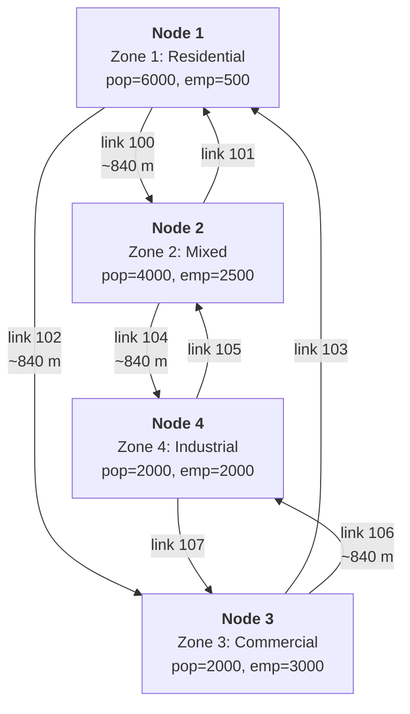
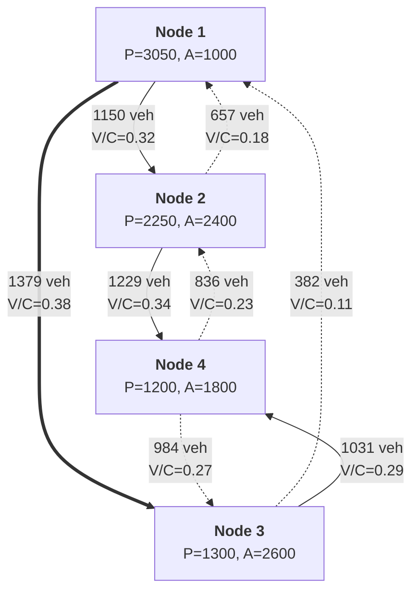

# simple_network

In-memory 4-zone diamond network with full pipeline execution.
No external files needed.

## Run

```sh
cargo run --example simple_network
```

## Network topology

4 intersection nodes arranged as a diamond, each serving as a zone centroid:

```text
       Zone 1 (residential)
         |
    [1]--+--[2]
     |         |
Zone 2         Zone 3
(mixed)        (commercial)
     |         |
    [3]--+--[4]
         |
       Zone 4 (industrial)
```

Detailed view with link IDs and zone attributes
(if your Markdown viewer does not render mermaid format, just use https://mermaid.live live viewer/editor):



Each diamond edge is a pair of one-way road segment links (forward + reverse),
giving 8 road links total. At each intersection, connection links allow all
turns except U-turns (8 connection links total). Total: 16 links.

All road segments: 2 lanes, 60 km/h free speed, 1800 veh/h capacity.
Connection links: 10 m length, 30 km/h, 1800 veh/h.

Assignment results on the graph (volume / capacity per link):



The thick arrow (1->3, 1379 veh) is the most loaded link - the main
commute corridor from residential zone 1 to commercial zone 3.
Dashed arrows show lighter reverse flows.

## Zones

| Zone | Name               | Population | Employment |
|------|--------------------|------------|------------|
| 1    | Residential North  | 6000       | 500        |
| 2    | Mixed East         | 4000       | 2500       |
| 3    | Commercial West    | 2000       | 3000       |
| 4    | Industrial South   | 2000       | 2000       |

**Total:** pop=14000, emp=8000.

## Model parameters

**Trip generation** - regression with default coefficients:
- Production: $P_i = 0.5 \cdot pop_i + 0.1 \cdot emp_i$
- Attraction: $A_i = 0.1 \cdot pop_i + 0.8 \cdot emp_i$

The ratio $P_{total} / E_{total} = 1.75$ ensures balanced totals
(required for Furness/IPF convergence):

$$\sum P_i = \sum A_i = 7800$$

**Trip distribution** - gravity model with exponential impedance:

$$f(t) = e^{-0.1 \cdot t}$$

Furness (IPF) balancing with default tolerance ($10^{-6}$, max 100 iterations).

**Mode choice** - multinomial logit with 3 modes:

| Mode | ASC  | Time coeff |
|------|------|------------|
| Auto | 0.0  | -0.03      |
| Bike | -1.0 | -0.05      |
| Walk | -2.0 | -0.08      |

**Assignment** - Frank-Wolfe, max 50 iterations, convergence gap $10^{-4}$,
BPR function with default $\alpha=0.15$, $\beta=4.0$.

**Feedback** - 3 iterations (assignment costs update skim for next distribution/mode choice pass).

## Results

All output is structured JSON via `tracing`.

### Step 1: Trip generation

| Zone | Name              | Productions | Attractions |
|------|-------------------|-------------|-------------|
| 1    | Residential North | 3050        | 1000        |
| 2    | Mixed East        | 2250        | 2400        |
| 3    | Commercial West   | 1300        | 2600        |
| 4    | Industrial South  | 1200        | 1800        |
| **Total** |              | **7800**    | **7800**    |

Zone 1 is the biggest trip producer (large population, few jobs),
while zones 3 and 4 are the biggest attractors (employment-heavy).
This matches the expected commute pattern: people live in zone 1
and travel to zones 3-4 for work.

### Step 2: Trip distribution

Gravity model with Furness balancing converges in 5 IPF iterations.
Total distributed trips = 7800 (matches generation totals exactly).

The exponential impedance $f(t) = e^{-0.1t}$ penalizes long trips.
On this small network all zones are ~1 km apart, so impedance
differences are small and trips distribute fairly evenly.

### Step 3: Mode choice

| Mode | Trips | Share |
|------|-------|-------|
| Auto | 5692  | 73.0% |
| Bike | 1787  | 22.9% |
| Walk | 320   | 4.1%  |

Auto dominates because it has the best ASC (0.0 vs -1.0 for bike, -2.0 for walk)
and the smallest time penalty coefficient (-0.03 vs -0.05, -0.08).
Walk share is low because the time penalty coefficient is steep (-0.08)
and walking at 5 km/h produces long travel times even on short distances.

### Step 4: Traffic assignment

Frank-Wolfe converges in **4 iterations** with relative gap $4.5 \times 10^{-5}$
(below the $10^{-4}$ threshold).

Top loaded links (5692 auto trips assigned to 8 road links).
Total capacity per link = 1800 veh/h/lane * 2 lanes = 3600 veh/h:

| Link | Direction | Volume (veh) | Cost (hours) | V/C ratio |
|------|-----------|--------------|--------------|-----------|
| 102  | 1 -> 3    | 1378.6       | 0.0140       | 0.38      |
| 104  | 2 -> 4    | 1229.1       | 0.0140       | 0.34      |
| 100  | 1 -> 2    | 1150.2       | 0.0140       | 0.32      |
| 106  | 3 -> 4    | 1031.4       | 0.0140       | 0.29      |
| 107  | 4 -> 3    | 983.7        | 0.0140       | 0.27      |
| 105  | 4 -> 2    | 836.3        | 0.0140       | 0.23      |
| 101  | 2 -> 1    | 656.9        | 0.0140       | 0.18      |
| 103  | 3 -> 1    | 381.7        | 0.0140       | 0.11      |

V/C ratios are very low (0.11-0.38) - the network has excess capacity
for this demand level. The BPR function adds virtually no delay:
free-flow time for ~840 m at 60 km/h is 0.014 h, and observed cost
is the same 0.014 h (congestion adds less than 0.3%).

This is expected: 5692 auto trips spread across 8 links with 3600 veh/h
each produces no meaningful congestion. To see BPR effects, you would
need to either reduce capacity (fewer lanes) or increase demand
(more population/employment).

Links 102 (1->3) and 104 (2->4) are the most loaded because they serve
the dominant flow from residential zone 1 toward employment zones 3 and 4.
Link 103 (3->1) is the least loaded - few people commute from commercial
zone 3 back to residential zone 1.

Connection links (108-115) carry zero volume because routing happens
at the link level - the assignment loads road segments, and connection
links serve only as topology connectors for turn permissions.

### Feedback convergence

3 feedback iterations were performed. The relative gap is stable
at $4.48 \times 10^{-5}$ across all iterations, meaning the skim
update has minimal impact on this small network. On larger networks
with congestion, feedback iterations would show the gap changing
as congested travel times shift distribution and mode choice.

### Timings

| Step           | Time (ms) |
|----------------|-----------|
| Generation     | 0.001     |
| Distribution   | 0.119     |
| Mode choice    | 0.553     |
| Assignment     | 7.823     |
| **Total**      | **8.996** |

Assignment dominates (87% of total time) because it runs Dijkstra
shortest paths on every iteration. Distribution and mode choice
are fast because the OD matrix is only 4x4.
